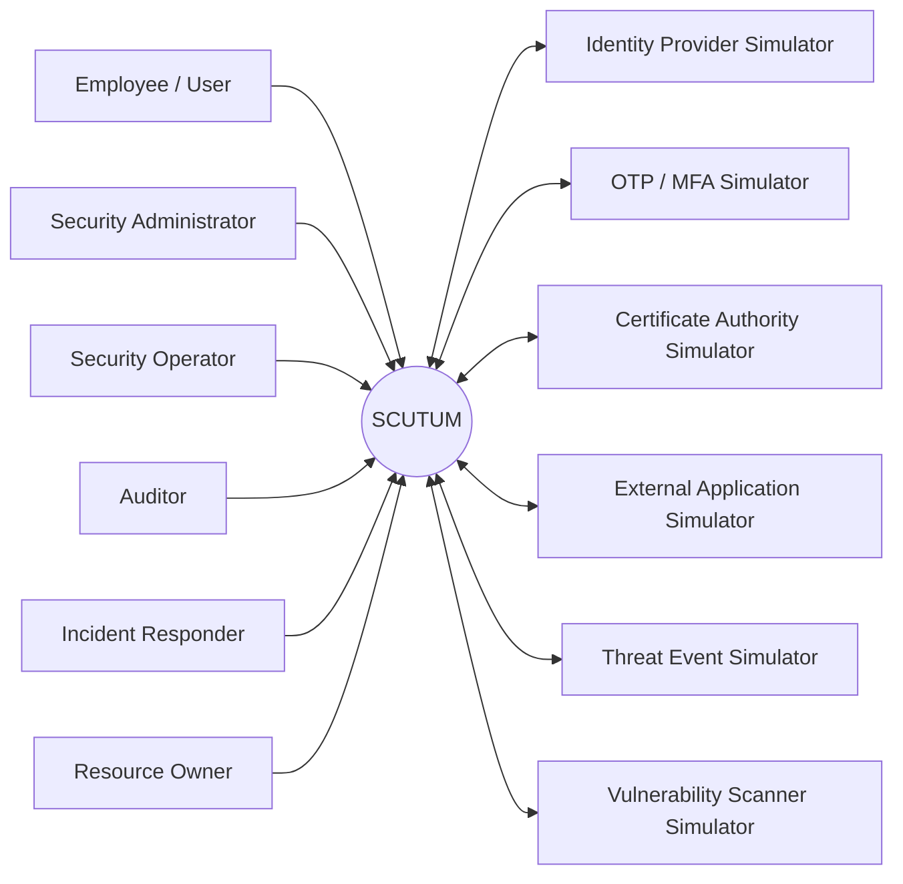
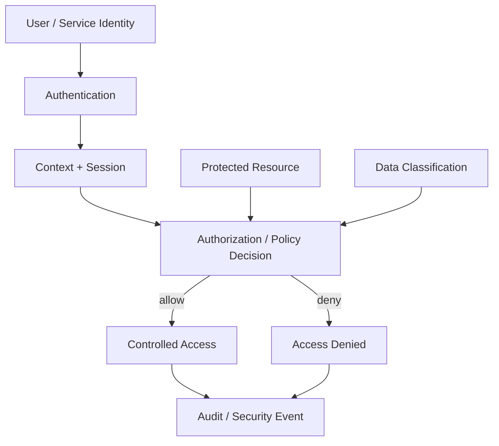
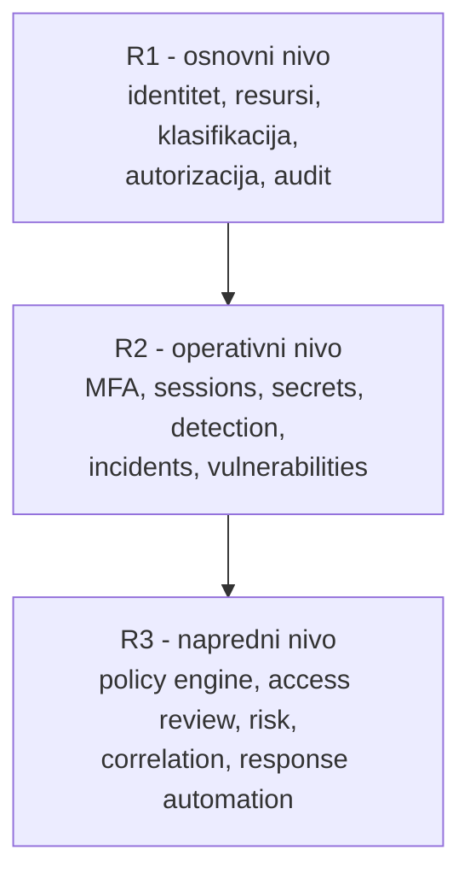
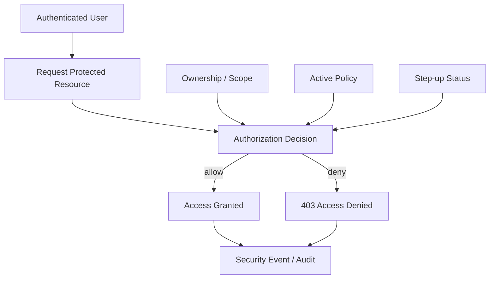
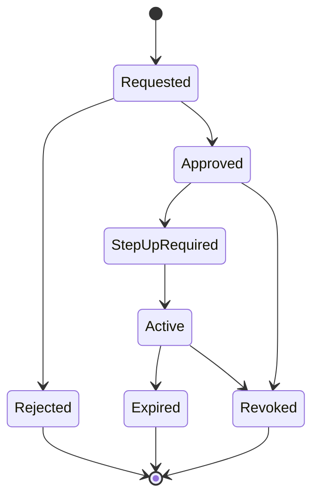
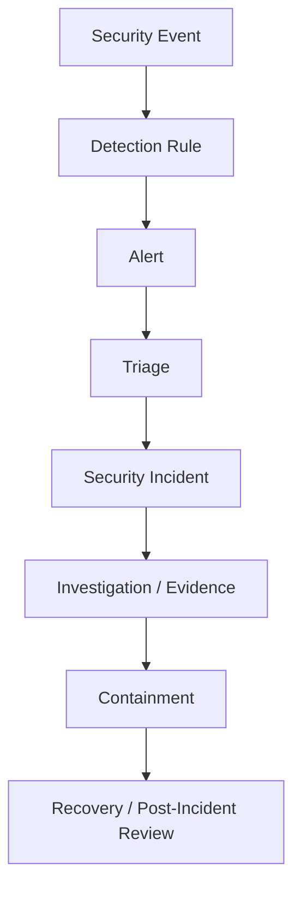
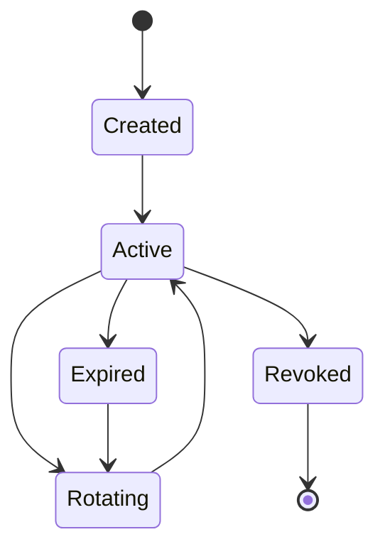
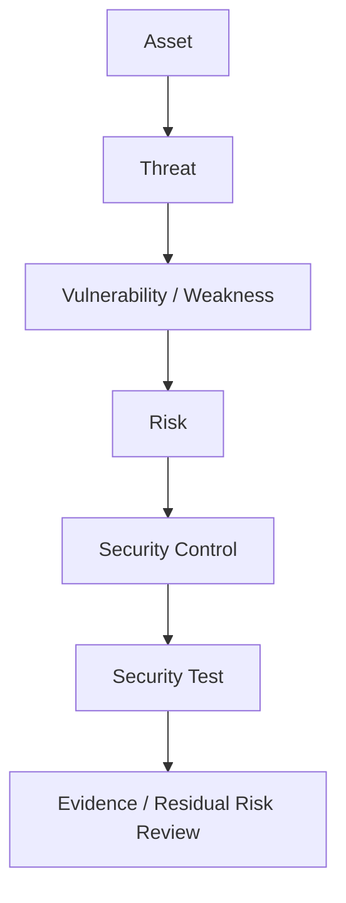
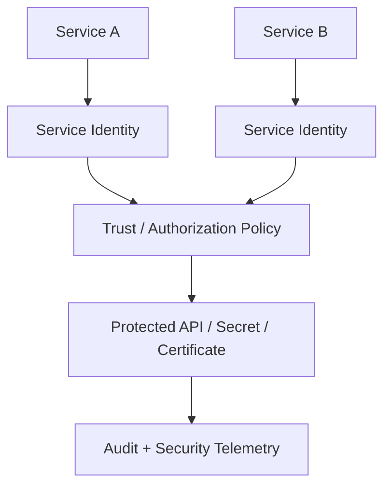

# SCUTUM

## Platforma za upravljanje informacionom bezbednošću i digitalnim poverenjem

**Projektna specifikacija za predmet Osnove informacione bezbednosti**  
Fakultet tehničkih nauka - Primenjeno softversko inženjerstvo  
**Verzija 1.2 - septembar 2026.**

---

## Osnovni podaci

| Stavka | Vrednost |
|---|---|
| Naziv projekta | **SCUTUM - Platforma za upravljanje informacionom bezbednošću i digitalnim poverenjem** |
| Predmet | Osnove informacione bezbednosti |
| Tip rada | Timski razvoj zajedničkog bezbednosnog softverskog proizvoda |
| Veličina tima | 6-10 studenata |
| Tipičan obim izvođenja | približno 200 studenata; broj timova zavisi od formirane veličine timova |
| Referentna tehnologija | .NET / C#; druge tehnologije uz odobrenje i dokaz interoperabilnosti |
| Organizacija rada | Git, feature grane, Pull Request, code review, CI i Tapiz Boards |
| Arhitektonski principi | Clean Architecture, SOLID, least privilege, explicit trust boundaries, testabilnost i auditabilnost |

## Pregled poglavlja

1. Svrha, cilj i granice projekta
2. Kontekst sistema i korisnici
3. Bezbednosni model sistema
4. Razvojni nivoi i dodela projektnih celina
5. Opšti tehnički i procesni zahtevi
6. Ključni bezbednosni tokovi i threat model
7. Projektne celine nivoa R1
8. Projektne celine nivoa R2
9. Projektne celine nivoa R3
10. Integracija, bezbednosno testiranje i kriterijumi završetka
11. Predaja, dokumentacija i kriterijumi ocenjivanja
12. Rečnik ključnih pojmova

---

# 1. Svrha, cilj i granice projekta

SCUTUM je informacioni sistem namenjen upravljanju identitetima, pristupom, bezbednosnim politikama, tajnama, bezbednosnim događajima, incidentima, rizicima i dokazima u organizaciji koja koristi veći broj aplikacija, servisa i informacionih resursa. Bezbednost nije dodatna funkcionalnost sistema, već osnovni domen projekta.

Projekat je defanzivno orijentisan. Ne zahteva razvoj eksploita, malvera niti napad na realne sisteme. Situacije koje predstavljaju sumnjivu aktivnost, grešku konfiguracije ili pokušaj nedozvoljenog pristupa reprodukuju se kontrolisanim simulatorima i testnim identitetima.

> **Cilj projektnog okvira.** Student treba da razume vezu između asset-a, identiteta, trust granice, pretnje, kontrole, bezbednosnog testa i audit dokaza. Implementacija kontrole bez jasnog bezbednosnog zahteva i testa ne smatra se završenim rešenjem.

## 1.1. Obuhvat

- identity lifecycle, autentikacija i sesije;
- RBAC, object-level i policy-based autorizacija;
- multi-factor i step-up autentikacija;
- privileged access i just-in-time prava;
- service identities;
- secrets, certificate i key lifecycle;
- klasifikacija podataka i zaštita resursa;
- security audit, događaji, detekcija i alerting;
- security incident, istraga, evidence i response;
- vulnerability i dependency risk registry;
- threat modeling, risk management i access review;
- security policies, exceptions i compliance evidence;
- automatizovani negativni i bezbednosni testovi.

## 1.2. Van obuhvata

- napad na stvarne organizacione ili javne sisteme;
- izrada malware-a, ransomware-a, phishing infrastrukture ili eksploita;
- implementacija sopstvenih kriptografskih algoritama;
- čuvanje realnih lozinki, tajni ili produkcionih sertifikata u studentskom okruženju;
- predstavljanje simulatora kao realnog IDS/SIEM/CA proizvoda;
- formalna pravna/compliance sertifikacija organizacije.

<!-- diagram:context -->


*Slika 1. Kontekst sistema SCUTUM: korisnici i spoljni bezbednosni simulatori.*


# 2. Kontekst sistema i korisnici

SCUTUM se posmatra kao centralna bezbednosna platforma koja održava identitete, politike, asset podatke i bezbednosne događaje za više aplikacija i organizacionih domena. Spoljni sistemi komuniciraju preko eksplicitnih adaptera ili simulatora.

## 2.1. Primarne uloge

| Uloga | Tipične odgovornosti |
|---|---|
| Employee / User | koristi zaštićene resurse u okviru dodeljenih prava |
| Resource Owner | određuje vlasništvo, klasifikaciju i odobrava određene pristupe |
| Security Administrator | politike, identity/security konfiguracija i privilegovane promene |
| Security Operator / Analyst | security events, alerts, triage i nadzor |
| Incident Responder | istraga, containment, recovery i post-incident review |
| Auditor / Read-only Operator | kontrolisan pregled audit-a, evidence-a i compliance dokaza |

## 2.2. Trust granice

Za svaki značajan tok mora biti jasno gde se identitet potvrđuje, gde se donosi odluka o pristupu, ko je vlasnik zaštićenog resursa i koje informacije prelaze granicu između komponenti.

<!-- diagram:zero-trust -->


*Slika 2. Pojednostavljen model donošenja odluke o pristupu.*


## 2.3. Simulatori

| Simulator | Primer ponašanja |
|---|---|
| Identity Provider Simulator | uspešna/neuspešna autentikacija, external identity |
| OTP / MFA Simulator | challenge, validan/nevalidan kod, timeout |
| Certificate Authority Simulator | izdavanje, obnova i revocation sertifikata |
| External Application Simulator | pozivi ka zaštićenom API-ju i service identity scenario |
| Threat Event Simulator | neuspešne prijave, suspicious access, privilegovana operacija |
| Vulnerability Scanner Simulator | kontrolisani nalazi vezani za testne asset-e |

# 3. Bezbednosni model sistema

SCUTUM ne polazi od pretpostavke da je korisnik, servis ili mrežna lokacija pouzdana samo zato što je uspešno prošla jedan prethodni korak. Svaka značajna operacija mora imati jasan identitet, scope i odluku o pristupu.

## 3.1. Osnovna pravila

- least privilege i need-to-know gde su relevantni;
- deny-by-default za osetljive operacije gde nije eksplicitno dozvoljeno;
- autentikacija i autorizacija su odvojene odgovornosti;
- validan token ne znači automatski pristup svakom resursu;
- object-level authorization proverava se serverski;
- privilegovani pristup treba da bude ograničen scope-om i vremenom;
- tajne se ne čuvaju u source code-u ili logovima;
- standardne proverene kriptografske biblioteke se koriste umesto sopstvenih algoritama;
- bezbednosna odluka mora biti proverljiva testom i audit događajem gde je značajno.

## 3.2. Bezbednosni tok kao dokaz

Svaka projektna celina treba da može da pokaže sledeći lanac kada je primenljiv:

```text
Asset -> Threat / Misuse -> Security Requirement -> Control -> Security Test -> Evidence
```

<!-- diagram:levels -->


*Slika 3. Razvojni nivoi projektnih celina; oznake predstavljaju funkcionalne preduslove.*


# 4. Razvojni nivoi i dodela projektnih celina

Oznake R1, R2 i R3 predstavljaju funkcionalne preduslove i zrelost projektne celine. Ne predstavljaju akademsku godinu i ne daju studentima pravo da samostalno izaberu temu. Celine dodeljuje nastavni tim.

| Nivo | Značenje | Tipični sadržaj |
|---|---|---|
| R1 - Osnovni | postavlja asset, identity, authorization, policy i audit temelje | identiteti, resursi, RBAC, klasifikacija, audit, baseline |
| R2 - Operativni | uvodi aktivne zaštitne i operativne bezbednosne procese | MFA, sessions, secrets, detection, incidents, vulnerabilities |
| R3 - Napredni | uvodi složenije policy, risk i response tokove | ABAC/policy engine, access review, risk, correlation, response automation |

> **Dodela projektnih celina.** Tim može razvijati novu celinu, proširivati postojeću ili bezbednosno refaktorisati postojeće rešenje. Nastavni tim može ranije aktivirati R2/R3 celinu ako su njeni preduslovi dostupni ili kontrolisano simulirani.

## 4.1. Timovi

Tim ima 6-10 studenata. Jedna projektna celina predstavlja primarnu odgovornost tima, a velika celina može se podeliti na jasno razdvojene epike ako broj timova to zahteva.

Svaki tim treba da demonstrira kombinaciju:

- nove ili izmenjene funkcionalnosti;
- najmanje jednog negativnog/abuse scenarija;
- automatizovanog bezbednosnog testa;
- najmanje jedne cross-team trust granice kada je domen to zahteva;
- threat model-a svoje celine;
- refaktorisanja ako postojeći dizajn onemogućava bezbednu implementaciju.

# 5. Opšti tehnički i procesni zahtevi

## 5.1. Tehnološki okvir

Podrazumevana i preporučena tehnologija je .NET / C#. Druga tehnologija može biti odobrena kada tim obezbedi interoperabilnost i ekvivalentan nivo testiranja i bezbednosne kontrole.

## 5.2. Arhitektura i bezbedan dizajn

- Clean Architecture ili ekvivalentno jasno razdvajanje domena, use-case sloja i infrastrukture;
- SOLID tamo gde smanjuje spregnutost i olakšava testiranje;
- auth/authz, secrets i audit ne smeju biti razbacani ad-hoc kroz kod;
- značajne trust granice moraju biti eksplicitne;
- bezbednosno kritične odluke dokumentuju se kratkim ADR zapisom;
- sopstveni crypto/password/token algoritmi nisu dozvoljeni;
- hard-coded credential-i i tajne nisu prihvatljivi.

## 5.3. Threat model po timu

Minimalni threat model mora sadržati:

| Element | Primer |
|---|---|
| Asset | korisnička sesija, tajna, dokument, privilegovana uloga |
| Threat / misuse | krađa sesije, horizontalni pristup, neovlašćena promena privilegije |
| Control | step-up, object authorization, revocation, audit |
| Test | negativni authorization test, expired/revoked credential test |
| Evidence | rezultat testa, audit događaj, konfiguracioni dokaz |

## 5.4. Testiranje

Framework zavisi od tehnologije: NUnit/Moq za .NET, Vitest/Jest za TypeScript ili ekvivalentan alat.

- unit testovi policy i poslovnih pravila;
- integration testovi authentication/authorization adaptera;
- object-level negative testovi;
- testovi isteka/revocation-a;
- testovi tenant/scope izolacije gde postoji;
- testovi security event/audit ishoda;
- regression test za stvarno otkriven bezbednosni problem kada je moguće.

## 5.5. Git, Pull Request i Tapiz Boards

```text
Tapiz task -> feature branch -> commits -> Pull Request -> CI + review -> VERIFY / SECURITY QA -> DONE
```

- direktan push na main nije dozvoljen;
- security requirement i acceptance kriterijumi moraju biti vidljivi u task-u;
- promena auth/authz ugovora zahteva review pogođenih timova;
- CI izvršava build, testove i relevantne security checks;
- tajne ne smeju biti commit-ovane u repozitorijum.

## 5.6. Definition of Done

- funkcionalni acceptance kriterijumi su ispunjeni;
- threat/misuse scenario je definisan;
- kontrola je implementirana i objašnjiva;
- najmanje jedan negativni security scenario je testiran;
- audit/security event postoji gde je relevantno;
- tajne i osetljivi podaci nisu izloženi;
- CI prolazi;
- PR je pregledan;
- dokumentacija i ADR su ažurirani;
- tim može objasniti residual risk ili poznato ograničenje.

# 6. Ključni bezbednosni tokovi i threat model

## 6.1. Pristup zaštićenom resursu

Autentikovan korisnik ne dobija automatski pravo pristupa konkretnom objektu. Odluka mora uzeti u obzir ownership/scope, aktivnu politiku i eventualni step-up zahtev.

<!-- diagram:access-flow -->


*Slika 4. Referentni tok pristupa zaštićenom resursu.*


## 6.2. Privilegovani pristup

Privilegovana prava predstavljaju poseban rizik i treba da budu eksplicitno zahtevana, odobrena, dodatno potvrđena i vremenski ograničena.

<!-- diagram:privileged -->


*Slika 5. Pojednostavljen životni ciklus privilegovanog pristupa.*


## 6.3. Bezbednosni događaj i incident

<!-- diagram:incident -->


*Slika 6. Veza bezbednosnog događaja, detekcije, incidenta i oporavka.*


## 6.4. Tajna ili servisni kredencijal

<!-- diagram:secret-lifecycle -->


*Slika 7. Pojednostavljen životni ciklus tajne ili pristupnog kredencijala.*


## 6.5. Threat -> Control -> Evidence

<!-- diagram:threat-chain -->


*Slika 8. Veza asset-a, pretnje, kontrole, testa i dokaza.*


## 6.6. Service-to-service trust

<!-- diagram:service-trust -->


*Slika 9. Konceptualna granica poverenja između servisnih identiteta.*


> **Napomena.** Projekat je defanzivno orijentisan. Negativni i abuse scenariji izvode se nad sopstvenim testnim sistemom i simulatorima, bez napada na realne spoljne sisteme.

## Pregled projektnih celina

| Oznaka | Projektna celina | Nivo | Glavni preduslovi |
|---|---|---|---|
| R1-01 | Organizacije, bezbednosni domeni i vlasništvo | R1 | nema obaveznih |
| R1-02 | Asset inventory i kritičnost resursa | R1 | R1-01 |
| R1-03 | Identity registry i životni ciklus korisnika | R1 | nema obaveznih |
| R1-04 | Osnovna autentikacija | R1 | R1-03 |
| R1-05 | Uloge i osnovni RBAC | R1 | R1-03 |
| R1-06 | Object-level authorization i vlasništvo resursa | R1 | R1-05, R1-02 |
| R1-07 | Klasifikacija podataka i pravila rukovanja | R1 | R1-02 |
| R1-08 | Security policy katalog | R1 | R1-01 |
| R1-09 | Audit log i bezbednosni događaji | R1 | R1-03, R1-05 |
| R1-10 | Secure configuration baseline | R1 | R1-02, R1-08 |
| R1-11 | Security notifications i odgovorni kontakti | R1 | R1-01, R1-09 |
| R1-12 | Security simulatori i test identities | R1 | nema obaveznih |
| R1-13 | Bezbednosna observability osnova | R1 | R1-09 |
| R1-14 | Security zone i trust-boundary registry | R1 | R1-01, R1-02 |
| R1-15 | Data retention i secure disposal policy | R1 | R1-07, R1-08 |
| R1-16 | Katalog bezbednosnih kontrola i vlasništvo | R1 | R1-01, R1-08 |
| R1-17 | Cryptographic asset inventory | R1 | R1-01, R1-02, R1-08 |
| R1-18 | External exposure i attack-surface registry | R1 | R1-02, R1-14 |
| R1-19 | Security data-source i log-source registry | R1 | R1-09, R1-13 |
| R1-20 | Data-flow i processing registry | R1 | R1-07, R1-14, R1-02 |
| R2-01 | Multi-factor i step-up autentikacija | R2 | R1-04, R1-12 |
| R2-02 | Sessions, tokens i revocation | R2 | R1-04, R1-09 |
| R2-03 | Privileged Access i Just-in-Time pristup | R2 | R1-05, R2-01 |
| R2-04 | Service identities i workload authentication | R2 | R1-02, R1-08 |
| R2-05 | Secrets management i lifecycle | R2 | R2-04, R1-09 |
| R2-06 | Certificates i key lifecycle | R2 | R1-12, R2-04 |
| R2-07 | Security detection rules | R2 | R1-09, R1-12 |
| R2-08 | Security alerts i triage | R2 | R2-07, R1-11 |
| R2-09 | Security incident management | R2 | R2-08, R1-02 |
| R2-10 | Investigation, evidence i timeline | R2 | R2-09, R1-09 |
| R2-11 | Vulnerability registry i remediation | R2 | R1-02, R1-12 |
| R2-12 | API i application security policies | R2 | R1-08, R1-10 |
| R2-13 | Dependency i software supply-chain registry | R2 | R1-02, R2-11 |
| R2-14 | Endpoint/device trust i posture | R2 | R1-02, R1-12, R2-01 |
| R2-15 | Data protection i DLP događaji | R2 | R1-07, R1-09, R1-14 |
| R2-16 | Backup protection i recovery assurance | R2 | R1-02, R1-08, R2-05 |
| R2-17 | Security telemetry ingestion i normalizacija | R2 | R1-19, R1-09, R1-12 |
| R2-18 | Kontrolisano deljenje i transfer osetljivih podataka | R2 | R1-07, R1-20, R1-06, R1-09 |
| R2-19 | Kriptografska politika i orchestration rotacije | R2 | R1-17, R2-05, R2-06, R1-08 |
| R2-20 | Security baseline drift i remediation | R2 | R1-10, R1-16, R1-02, R1-12 |
| R3-01 | Policy engine i atributska autorizacija | R3 | R1-06, R1-07, R1-08 |
| R3-02 | Periodic access review i certification | R3 | R1-05, R2-03, R2-04 |
| R3-03 | Risk register i procena bezbednosnog rizika | R3 | R1-02, R2-11 |
| R3-04 | Threat modeling workflow | R3 | R1-02, R3-03 |
| R3-05 | Security event correlation i analytics | R3 | R1-09, R2-07 |
| R3-06 | Automatizacija containment i response akcija | R3 | R2-02, R2-09, R2-05 |
| R3-07 | Compliance evidence i control mapping | R3 | R1-08, R1-09 |
| R3-08 | Security exceptions i risk acceptance | R3 | R1-08, R1-10, R3-03 |
| R3-09 | Post-incident review i security improvement tracking | R3 | R2-09, R2-10 |
| R3-10 | Attack-path i exposure graph analiza | R3 | R1-02, R1-14, R2-11, R3-04 |
| R3-11 | Third-party i supplier security assessment | R3 | R1-02, R1-16, R3-03 |
| R3-12 | Continuous control effectiveness i security posture | R3 | R1-16, R3-05, R3-07 |
| R3-13 | Segregation of duties i toxic-access analiza | R3 | R1-05, R1-06, R2-03, R3-02 |
| R3-14 | Risk-based adaptive authentication | R3 | R2-01, R2-02, R2-14, R1-08 |
| R3-15 | Detection engineering, simulacija i tuning pravila | R3 | R2-07, R2-17, R1-12 |
| R3-16 | Data-access anomaly i exfiltration risk analitika | R3 | R1-07, R2-15, R2-17, R3-05 |
| R3-17 | Software provenance i release trust verifikacija | R3 | R2-13, R2-11, R1-16 |
| R3-18 | Privacy impact i data-processing assessment | R3 | R1-07, R1-20, R3-03, R1-16 |
| R3-19 | Cryptographic posture i migration planning | R3 | R1-17, R2-19, R3-10 |
| R3-20 | Security metrics, risk quantification i executive posture | R3 | R3-03, R3-05, R3-07, R3-12 |

<div class="page-break"></div>

# 7. Projektne celine nivoa R1

Celine R1 formiraju osnovni model identiteta, asset-a, pristupa, klasifikacije, policy-ja i audit-a.

## R1-01. Organizacije, bezbednosni domeni i vlasništvo

Model organizacionih celina, bezbednosnih domena i odgovornosti nad resursima.

| Element | Specifikacija |
|---|---|
| Ključni pojmovi | Organization, SecurityDomain, Owner, Criticality, Scope |
| Preduslovi | Nema obaveznih funkcionalnih preduslova. |

### Obavezni use-case-ovi

- kreiranje organizacije i bezbednosnog domena
- dodela vlasnika
- povezivanje resursa sa domenom
- promena kritičnosti
- deaktivacija domena

### Ključna bezbednosna pravila

- svaki zaštićeni resurs mora imati vlasnika ili eksplicitno definisan sistemski scope
- deaktiviran domen ne prima nove resurse
- promena vlasništva mora biti auditovana

### Moguća proširenja

- hijerarhija domena
- delegirani owner
- shared ownership policy

> **Dokaz završetka.** Celina mora imati izvršive ključne use-case-ove, automatizovane testove, dokumentovanu granicu poverenja prema drugim celinama i najmanje jedan reprezentativan negativni ili abuse-case scenario.
## R1-02. Asset inventory i kritičnost resursa

Centralna evidencija aplikacija, servisa, uređaja, podataka i drugih informacionih resursa.

| Element | Specifikacija |
|---|---|
| Ključni pojmovi | Asset, AssetType, AssetOwner, Criticality, LifecycleStatus |
| Preduslovi | R1-01 |

### Obavezni use-case-ovi

- registracija asset-a
- dodela vlasnika
- klasifikacija kritičnosti
- promena statusa
- pretraga po domenu i vlasniku

### Ključna bezbednosna pravila

- asset mora imati jedinstven identitet
- dekomisioniran asset ostaje u istoriji
- kritičnost mora biti eksplicitna i auditovana

### Moguća proširenja

- dependency link
- business service map
- asset import

> **Dokaz završetka.** Celina mora imati izvršive ključne use-case-ove, automatizovane testove, dokumentovanu granicu poverenja prema drugim celinama i najmanje jedan reprezentativan negativni ili abuse-case scenario.
## R1-03. Identity registry i životni ciklus korisnika

Upravljanje identitetima zaposlenih, saradnika i drugih ljudskih korisnika.

| Element | Specifikacija |
|---|---|
| Ključni pojmovi | Identity, Person, Account, IdentityStatus, EmploymentContext |
| Preduslovi | Nema obaveznih funkcionalnih preduslova. |

### Obavezni use-case-ovi

- kreiranje identiteta
- aktiviranje/suspenzija
- povezivanje naloga
- promena statusa
- gašenje pristupa pri prestanku angažmana

### Ključna bezbednosna pravila

- jedna osoba ne sme nekontrolisano imati više nepovezanih privilegovanih identiteta
- suspendovan identitet ne može dobiti novu sesiju
- gašenje mora ukloniti aktivne privilegije prema politici

### Moguća proširenja

- external identities
- identity merge
- temporary contractor lifecycle

> **Dokaz završetka.** Celina mora imati izvršive ključne use-case-ove, automatizovane testove, dokumentovanu granicu poverenja prema drugim celinama i najmanje jedan reprezentativan negativni ili abuse-case scenario.
## R1-04. Osnovna autentikacija

Pouzdana potvrda identiteta korisnika korišćenjem standardnih mehanizama i biblioteka.

| Element | Specifikacija |
|---|---|
| Ključni pojmovi | Credential, AuthenticationAttempt, AuthenticationOutcome, PasswordPolicy, LockoutState |
| Preduslovi | R1-03 |

### Obavezni use-case-ovi

- prijava korisnika
- odbijanje neispravnih podataka
- kontrolisani lockout/rate policy
- promena kredencijala
- oporavak pristupa kroz simulirani kanal

### Ključna bezbednosna pravila

- lozinke se ne čuvaju u otvorenom obliku
- sopstveni kriptografski algoritmi nisu dozvoljeni
- odgovor ne sme nepotrebno otkrivati da li nalog postoji
- auth failure mora biti auditovan

### Moguća proširenja

- passwordless adapter
- external IdP
- risk-based authentication signal

> **Dokaz završetka.** Celina mora imati izvršive ključne use-case-ove, automatizovane testove, dokumentovanu granicu poverenja prema drugim celinama i najmanje jedan reprezentativan negativni ili abuse-case scenario.
## R1-05. Uloge i osnovni RBAC

Model uloga i dozvola nad funkcionalnim celinama sistema.

| Element | Specifikacija |
|---|---|
| Ključni pojmovi | Role, Permission, Assignment, Scope, EffectivePermission |
| Preduslovi | R1-03 |

### Obavezni use-case-ovi

- kreiranje uloge
- dodela dozvole
- dodela uloge korisniku
- ukidanje uloge
- izračunavanje efektivnih dozvola

### Ključna bezbednosna pravila

- dozvola se proverava serverski
- uloga ne sme implicitno davati pristup izvan scope-a
- privilegovana dodela se audit-uje

### Moguća proširenja

- role hierarchy
- scoped role
- separation-of-duties rule

> **Dokaz završetka.** Celina mora imati izvršive ključne use-case-ove, automatizovane testove, dokumentovanu granicu poverenja prema drugim celinama i najmanje jedan reprezentativan negativni ili abuse-case scenario.
## R1-06. Object-level authorization i vlasništvo resursa

Provera da li korisnik sme pristupiti konkretnom objektu, ne samo tipu endpoint-a.

| Element | Specifikacija |
|---|---|
| Ključni pojmovi | ProtectedResource, ResourceOwner, AccessDecision, Subject, Action |
| Preduslovi | R1-05, R1-02 |

### Obavezni use-case-ovi

- provera vlasništva
- provera scope-a
- dozvola/odbijanje konkretne operacije
- promena owner-a
- negativni pristup tuđem resursu

### Ključna bezbednosna pravila

- poznavanje resource ID-a nije pravo pristupa
- UI filter ne zamenjuje serversku autorizaciju
- svaki deny treba dati kontrolisan ishod bez curenja podataka

### Moguća proširenja

- shared resource access
- delegation
- resource group policy

> **Dokaz završetka.** Celina mora imati izvršive ključne use-case-ove, automatizovane testove, dokumentovanu granicu poverenja prema drugim celinama i najmanje jedan reprezentativan negativni ili abuse-case scenario.
## R1-07. Klasifikacija podataka i pravila rukovanja

Klasifikovanje podataka prema osetljivosti i vezivanje bezbednosnih pravila za klasifikaciju.

| Element | Specifikacija |
|---|---|
| Ključni pojmovi | DataClassification, HandlingRule, RetentionClass, Sensitivity, DataOwner |
| Preduslovi | R1-02 |

### Obavezni use-case-ovi

- definisanje klasifikacionog nivoa
- dodela klasifikacije resursu/dokumentu
- validacija dozvoljenog rukovanja
- promena klasifikacije
- pregled klasifikovanih resursa

### Ključna bezbednosna pravila

- klasifikacija mora imati vlasnika i značenje
- niži nivo zaštite ne sme automatski prepisati viši bez odobrenja
- retention i pristup moraju koristiti aktivnu klasifikaciju

### Moguća proširenja

- data labels
- handling matrix
- cross-domain sharing rule

> **Dokaz završetka.** Celina mora imati izvršive ključne use-case-ove, automatizovane testove, dokumentovanu granicu poverenja prema drugim celinama i najmanje jedan reprezentativan negativni ili abuse-case scenario.
## R1-08. Security policy katalog

Centralizovana evidencija bezbednosnih pravila i njihovog opsega primene.

| Element | Specifikacija |
|---|---|
| Ključni pojmovi | SecurityPolicy, PolicyVersion, PolicyScope, EffectivePeriod, PolicyStatus |
| Preduslovi | R1-01 |

### Obavezni use-case-ovi

- kreiranje politike
- verzionisanje
- aktiviranje nove verzije
- povezivanje sa domenom/asset-om
- arhiviranje stare verzije

### Ključna bezbednosna pravila

- objavljena politika se ne menja u mestu
- istorijski događaj mora moći da se poveže sa politikom koja je tada važila
- kontradiktorne politike zahtevaju definisano pravilo prioriteta

### Moguća proširenja

- policy inheritance
- exception link
- policy review period

> **Dokaz završetka.** Celina mora imati izvršive ključne use-case-ove, automatizovane testove, dokumentovanu granicu poverenja prema drugim celinama i najmanje jedan reprezentativan negativni ili abuse-case scenario.
## R1-09. Audit log i bezbednosni događaji

Sledljiva evidencija značajnih bezbednosnih i administrativnih aktivnosti.

| Element | Specifikacija |
|---|---|
| Ključni pojmovi | SecurityEvent, AuditEvent, Actor, Action, Target, Outcome, CorrelationId |
| Preduslovi | R1-03, R1-05 |

### Obavezni use-case-ovi

- beleženje prijave i pristupa
- beleženje promene privilegije
- pretraga događaja
- korelacija aktivnosti
- izvoz ograničenog pregleda

### Ključna bezbednosna pravila

- audit zapis se ne menja nakon upisa
- tajne i kredencijali se ne zapisuju
- bezbednosni događaj mora razlikovati uspešan i neuspešan ishod

### Moguća proširenja

- tamper-evident hash
- retention
- event severity

> **Dokaz završetka.** Celina mora imati izvršive ključne use-case-ove, automatizovane testove, dokumentovanu granicu poverenja prema drugim celinama i najmanje jedan reprezentativan negativni ili abuse-case scenario.
## R1-10. Secure configuration baseline

Definisanje i provera minimalnih bezbednosnih konfiguracionih zahteva za aplikacije i servise.

| Element | Specifikacija |
|---|---|
| Ključni pojmovi | SecurityBaseline, ConfigurationRule, TargetType, ComplianceStatus, ExceptionRef |
| Preduslovi | R1-02, R1-08 |

### Obavezni use-case-ovi

- kreiranje baseline-a
- povezivanje pravila sa asset tipom
- provera konfiguracije
- evidencija odstupanja
- odobravanje izuzetka kroz referencu

### Ključna bezbednosna pravila

- tajna nije konfiguraciona vrednost u plain text-u
- baseline mora imati verziju
- odstupanje ne sme biti skriveno promenom očekivane vrednosti bez politike

### Moguća proširenja

- environment-specific baseline
- automated config scan
- baseline inheritance

> **Dokaz završetka.** Celina mora imati izvršive ključne use-case-ove, automatizovane testove, dokumentovanu granicu poverenja prema drugim celinama i najmanje jedan reprezentativan negativni ili abuse-case scenario.
## R1-11. Security notifications i odgovorni kontakti

Obaveštavanje odgovornih osoba o bezbednosno relevantnim promenama i događajima.

| Element | Specifikacija |
|---|---|
| Ključni pojmovi | SecurityNotification, Recipient, Channel, NotificationType, DeliveryStatus |
| Preduslovi | R1-01, R1-09 |

### Obavezni use-case-ovi

- slanje upozorenja
- obaveštenje vlasnika resursa
- obaveštenje o promeni privilegije
- praćenje statusa
- ponovni pokušaj kroz simulator

### Ključna bezbednosna pravila

- notification failure ne sme rušiti osnovnu bezbednosnu odluku
- duplirani događaj ne treba nekontrolisano da generiše duplikate
- obaveštenje ne sadrži tajne

### Moguća proširenja

- digest
- escalation
- quiet hours policy

> **Dokaz završetka.** Celina mora imati izvršive ključne use-case-ove, automatizovane testove, dokumentovanu granicu poverenja prema drugim celinama i najmanje jedan reprezentativan negativni ili abuse-case scenario.
## R1-12. Security simulatori i test identities

Kontrolisano simuliranje spoljnih identiteta, MFA odgovora, bezbednosnih događaja i skenerskih nalaza.

| Element | Specifikacija |
|---|---|
| Ključni pojmovi | SimulatorProfile, TestIdentity, SecuritySignal, Scenario, SimulationOutcome |
| Preduslovi | Nema obaveznih funkcionalnih preduslova. |

### Obavezni use-case-ovi

- simulacija IdP odgovora
- simulacija OTP/MFA toka
- generisanje security event-a
- generisanje vulnerability finding-a
- ponovljiv scenario

### Ključna bezbednosna pravila

- simulator ne implementira realni napad nad spoljnim sistemom
- scenario mora biti ponovljiv
- test identiteti se jasno odvajaju od realnih naloga

### Moguća proširenja

- scenario library
- controlled failure
- time-based simulation

> **Dokaz završetka.** Celina mora imati izvršive ključne use-case-ove, automatizovane testove, dokumentovanu granicu poverenja prema drugim celinama i najmanje jedan reprezentativan negativni ili abuse-case scenario.
## R1-13. Bezbednosna observability osnova

Zajednička pravila za correlation, strukturisane logove i osnovne security metrike.

| Element | Specifikacija |
|---|---|
| Ključni pojmovi | TraceContext, SecurityMetric, LogEvent, CorrelationId, SourceComponent |
| Preduslovi | R1-09 |

### Obavezni use-case-ovi

- propagacija correlation id-a
- strukturisani log
- security counter/metrika
- pregled health signala
- povezivanje događaja kroz komponente

### Ključna bezbednosna pravila

- logovi ne sadrže lozinke, token vrednosti ili tajne
- security metric mora imati jasno značenje
- correlation ne sme biti jedini mehanizam autorizacije

### Moguća proširenja

- distributed tracing
- SLO/SLA security metrics
- sampling policy

> **Dokaz završetka.** Celina mora imati izvršive ključne use-case-ove, automatizovane testove, dokumentovanu granicu poverenja prema drugim celinama i najmanje jedan reprezentativan negativni ili abuse-case scenario.


<div class="page-break"></div>

## R1-14. Security zone i trust-boundary registry

Eksplicitna evidencija trust zona, granica poverenja i dozvoljenih tokova između asset-a radi doslednog threat modelovanja i autorizacionih odluka.

| Element | Specifikacija |
|---|---|
| Ključni pojmovi | TrustZone, TrustBoundary, DataFlow, EntryPoint, BoundaryOwner, TrustLevel |
| Preduslovi | R1-01, R1-02 |

### Obavezni use-case-ovi

- kreiranje trust zone i dodela vlasnika
- povezivanje asset-a sa jednom ili više relevantnih zona
- evidencija data flow-a koji prelazi trust boundary
- registracija entry/exit point-a i protokola na konceptualnom nivou
- pregled svih crossing-a prema zoni i asset-u
- deaktivacija ili promena zone uz impact pregled postojećih tokova

### Ključna bezbednosna pravila

- svaki trust-boundary crossing mora imati jasan izvor, odredište i vlasnika
- spoljni/nepoznati izvor ne dobija implicitno poverenje
- promena zone asset-a mora pokrenuti pregled relevantnih policy i threat pretpostavki
- registry ne predstavlja firewall konfiguraciju i ne sme glumiti realnu mrežnu zaštitu

### Moguća proširenja

- data-flow diagram iz registra
- zone inheritance
- integracija sa policy engine-om kao decision input

> **Dokaz završetka.** Celina mora imati izvršive ključne use-case-ove, automatizovane testove, dokumentovanu granicu poverenja prema drugim celinama i najmanje jedan reprezentativan negativni ili abuse-case scenario.


## R1-15. Data retention i secure disposal policy

Model pravila koliko dugo se podaci čuvaju, kada se mogu bezbedno ukloniti i kako se evidentira legal/operational hold.

| Element | Specifikacija |
|---|---|
| Ključni pojmovi | RetentionPolicy, DataClass, RetentionPeriod, LegalHold, DisposalRequest, DisposalEvidence |
| Preduslovi | R1-07, R1-08 |

### Obavezni use-case-ovi

- definisanje retention pravila po klasifikaciji podataka
- povezivanje dataset/asset tipa sa pravilom zadržavanja
- izračunavanje planiranog datuma isteka
- postavljanje i uklanjanje legal/operational hold-a
- odobravanje secure disposal zahteva
- evidencija dokaza da je simulirano uklanjanje završeno prema politici

### Ključna bezbednosna pravila

- aktivan hold sprečava disposal bez eksplicitno dozvoljene procedure
- promena retention pravila mora biti verzionisana i ne sme retroaktivno sakriti prethodni zahtev
- disposal evidence ne sme sadržati samu osetljivu vrednost koja je uklonjena
- istek perioda ne znači automatsko fizičko brisanje bez uspešnog workflow-a

### Moguća proširenja

- grace period i review pre disposal-a
- policy konflikt resolver
- retention dashboard po data klasi

> **Dokaz završetka.** Celina mora imati izvršive ključne use-case-ove, automatizovane testove, dokumentovanu granicu poverenja prema drugim celinama i najmanje jedan reprezentativan negativni ili abuse-case scenario.


## R1-16. Katalog bezbednosnih kontrola i vlasništvo

Centralni katalog tehničkih i procesnih security kontrola, njihovih vlasnika, očekivanih dokaza i statusa implementacije.

| Element | Specifikacija |
|---|---|
| Ključni pojmovi | SecurityControl, ControlOwner, ControlType, ImplementationStatus, EvidenceRequirement, ReviewCycle |
| Preduslovi | R1-01, R1-08 |

### Obavezni use-case-ovi

- registracija security kontrole i njenog cilja
- dodela control owner-a
- povezivanje kontrole sa policy zahtevom ili asset scope-om
- definisanje očekivanog tipa dokaza i perioda pregleda
- promena implementation statusa uz obrazloženje
- pregled kontrola bez vlasnika, dokaza ili aktuelnog review-a

### Ključna bezbednosna pravila

- kontrola bez vlasnika mora biti označena kao governance gap
- samo postojanje kontrolnog zapisa ne dokazuje da je kontrola efektivna
- promena cilja ili scope-a kontrole mora biti auditovana
- kontrola povučena iz upotrebe ostaje u istoriji radi sledljivosti prethodnih dokaza

### Moguća proširenja

- control family/hierarchy
- mapiranje na više internih standarda
- automatski review reminder

> **Dokaz završetka.** Celina mora imati izvršive ključne use-case-ove, automatizovane testove, dokumentovanu granicu poverenja prema drugim celinama i najmanje jedan reprezentativan negativni ili abuse-case scenario.


## R1-17. Cryptographic asset inventory

Centralna evidencija kriptografskih sredstava i referenci na ključeve, sertifikate i tajne bez čuvanja njihovog osetljivog sadržaja.

| Element | Specifikacija |
|---|---|
| Ključni pojmovi | CryptoAsset, KeyReference, CertificateReference, SecretReference, Algorithm, Owner |
| Preduslovi | R1-01, R1-02, R1-08 |

### Obavezni use-case-ovi

- registracija kriptografskog sredstva i njegove namene
- dodela vlasnika, sistema i bezbednosnog domena
- evidencija algoritma, dužine i statusa bez izlaganja tajnog materijala
- povezivanje sa aplikacijom, servisom ili uređajem
- praćenje perioda važenja i planiranog datuma rotacije
- označavanje sredstva kao compromised/revoked/retired
- pregled kriptografskih sredstava po vlasniku, tipu i kritičnosti

### Ključna poslovna pravila

- inventar ne sme čuvati privatni ključ ili plaintext secret
- svako aktivno sredstvo mora imati vlasnika i namenu
- isteklo ili revoked sredstvo ne sme biti prikazano kao važeće
- istorija statusa i rotacija mora ostati sledljiva
- algoritam označen kao zabranjen politikom mora proizvesti nalaz

### Moguća proširenja

- crypto policy katalog
- import metadata iz PKI/vault simulatora
- upozorenja na skori istek

| **Dokaz završetka:** Celina mora imati izvršive ključne use-case-ove, automatizovane testove poslovnih pravila, dokumentovanu javnu granicu prema drugim celinama i najmanje jedan reprezentativan demo scenario. |
|-------------------------------------------------------------------------------------------------------------------------------------------------------------------------------------------------------------------|


## R1-18. External exposure i attack-surface registry

Evidencija spolja izloženih servisa, endpoint-a, portova i domena radi razumevanja attack surface-a organizacije.

| Element | Specifikacija |
|---|---|
| Ključni pojmovi | Exposure, InternetEndpoint, ServicePort, DomainName, ExposureOwner, ExposureStatus |
| Preduslovi | R1-02, R1-14 |

### Obavezni use-case-ovi

- registracija spolja dostupnog endpoint-a ili servisa
- povezivanje exposure-a sa asset-om, vlasnikom i security zonom
- evidencija protokola, porta i namene
- označavanje odobrenog, privremenog ili nepoznatog exposure-a
- periodična potvrda da je exposure i dalje potreban
- zatvaranje exposure zapisa nakon uklanjanja sa spoljne površine
- pregled exposure-a po kritičnosti i vlasniku

### Ključna poslovna pravila

- svaki aktivni exposure mora imati vlasnika i poslovno obrazloženje
- nepoznat exposure mora biti označen za proveru, ne automatski proglašen ranjivošću
- zatvoren exposure ostaje u istoriji
- promena izloženosti kritičnog servisa mora biti auditovana
- endpoint detalji dostupni su samo u okviru dozvoljenog security scope-a

### Moguća proširenja

- simulirani external discovery feed
- DNS/TLS metadata
- attack-surface trend po periodu

| **Dokaz završetka:** Celina mora imati izvršive ključne use-case-ove, automatizovane testove poslovnih pravila, dokumentovanu javnu granicu prema drugim celinama i najmanje jedan reprezentativan demo scenario. |
|-------------------------------------------------------------------------------------------------------------------------------------------------------------------------------------------------------------------|


## R1-19. Security data-source i log-source registry

Katalog izvora bezbednosnih događaja, logova i telemetry podataka sa informacijama o vlasniku, šemi, kvalitetu i očekivanoj dostupnosti.

| Element | Specifikacija |
|---|---|
| Ključni pojmovi | SecurityDataSource, LogSource, EventSchema, SourceOwner, CollectionStatus, DataQuality |
| Preduslovi | R1-09, R1-13 |

### Obavezni use-case-ovi

- registracija security/log izvora
- povezivanje izvora sa asset-om, servisom ili domenom
- definisanje očekivane šeme i kategorija događaja
- promena collection statusa i razloga prekida
- praćenje poslednjeg primljenog događaja i freshness-a
- evidencija data-quality problema
- pregled coverage-a ključnih asset-a security izvorima

### Ključna poslovna pravila

- izvor mora imati vlasnika i jasno definisanu svrhu prikupljanja
- gubitak izvora ne sme biti predstavljen kao odsustvo bezbednosnih događaja
- šema mora biti verzionisana kada se semantika promeni
- pristup osetljivim log metadata mora poštovati security scope
- data-quality problem mora ostati sledljiv do izvora i perioda

### Moguća proširenja

- log onboarding checklist
- source criticality score
- simulator prekida log feed-a

| **Dokaz završetka:** Celina mora imati izvršive ključne use-case-ove, automatizovane testove poslovnih pravila, dokumentovanu javnu granicu prema drugim celinama i najmanje jedan reprezentativan demo scenario. |
|-------------------------------------------------------------------------------------------------------------------------------------------------------------------------------------------------------------------|


## R1-20. Data-flow i processing registry

Model ključnih tokova podataka između sistema, trust zona i organizacija radi podrške threat modelingu, klasifikaciji i proceni zaštite podataka.

| Element | Specifikacija |
|---|---|
| Ključni pojmovi | DataFlow, DataStore, ProcessingPurpose, SourceSystem, DestinationSystem, TrustBoundary |
| Preduslovi | R1-07, R1-14, R1-02 |

### Obavezni use-case-ovi

- registracija toka podataka između izvora i odredišta
- dodela klasifikacije podataka koji se prenose
- evidencija poslovne svrhe i vlasnika toka
- označavanje prelaska trust boundary-ja
- povezivanje toka sa servisom, API-jem ili skladištem
- promena ili deaktivacija toka uz istoriju
- pregled tokova koji prenose osetljive klase podataka

### Ključna poslovna pravila

- aktivan tok osetljivih podataka mora imati vlasnika i dokumentovanu svrhu
- prelazak trust granice mora imati definisanu zaštitnu kontrolu ili eksplicitan gap
- deaktivacija toka ne briše istorijski model
- klasifikacija odredišnog podatka ne sme biti tiho niža od politike bez odobrenog pravila
- model ne sme sadržati stvarne tajne ili puni sadržaj korisničkih podataka

### Moguća proširenja

- vizuelni DFD prikaz
- data residency metadata
- automatsko obogaćivanje threat modela

| **Dokaz završetka:** Celina mora imati izvršive ključne use-case-ove, automatizovane testove poslovnih pravila, dokumentovanu javnu granicu prema drugim celinama i najmanje jedan reprezentativan demo scenario. |
|-------------------------------------------------------------------------------------------------------------------------------------------------------------------------------------------------------------------|


# 8. Projektne celine nivoa R2

Celine R2 uvode aktivne mehanizme zaštite, operativne bezbednosne procese i reakciju na security signal.

## R2-01. Multi-factor i step-up autentikacija

Dodatna potvrda identiteta za rizične ili privilegovane operacije.

| Element | Specifikacija |
|---|---|
| Ključni pojmovi | MfaChallenge, Factor, StepUpContext, ChallengeStatus, RiskReason |
| Preduslovi | R1-04, R1-12 |

### Obavezni use-case-ovi

- pokretanje MFA challenge-a
- potvrda faktora kroz simulator
- istek challenge-a
- step-up za privilegovanu operaciju
- odbijanje ponovljenog/zastarelog challenge-a

### Ključna bezbednosna pravila

- MFA token/challenge ima kratak vek
- uspešna osnovna prijava ne znači automatski dovoljan assurance za svaku operaciju
- replay challenge-a mora biti odbijen

### Moguća proširenja

- multiple factors
- remembered device policy
- risk-triggered step-up

> **Dokaz završetka.** Celina mora imati izvršive ključne use-case-ove, automatizovane testove, dokumentovanu granicu poverenja prema drugim celinama i najmanje jedan reprezentativan negativni ili abuse-case scenario.
## R2-02. Sessions, tokens i revocation

Upravljanje aktivnim sesijama i tokenima bez oslanjanja na beskonačno važenje pristupa.

| Element | Specifikacija |
|---|---|
| Ključni pojmovi | Session, AccessTokenRef, RefreshTokenRef, Revocation, SessionState |
| Preduslovi | R1-04, R1-09 |

### Obavezni use-case-ovi

- kreiranje sesije
- obnova pristupa
- ukidanje sesije
- ukidanje svih sesija korisnika
- pregled aktivnih sesija

### Ključna bezbednosna pravila

- token životni vek mora biti konačan
- revoked session ne sme nastaviti da dobija pristup
- token vrednosti se ne zapisuju u log

### Moguća proširenja

- device-bound session
- session risk score
- concurrent session policy

> **Dokaz završetka.** Celina mora imati izvršive ključne use-case-ove, automatizovane testove, dokumentovanu granicu poverenja prema drugim celinama i najmanje jedan reprezentativan negativni ili abuse-case scenario.
## R2-03. Privileged Access i Just-in-Time pristup

Privremeno dodeljivanje privilegovanih prava uz odobrenje, step-up i automatski istek.

| Element | Specifikacija |
|---|---|
| Ključni pojmovi | PrivilegedAccessRequest, Approval, PrivilegeGrant, ExpiresAt, Revocation |
| Preduslovi | R1-05, R2-01 |

### Obavezni use-case-ovi

- podnošenje zahteva
- odobravanje/odbijanje
- step-up potvrda
- aktiviranje privilegije
- automatski istek
- hitno ukidanje

### Ključna bezbednosna pravila

- privilegija mora imati razlog i rok
- odobrenje i izvršenje mogu zahtevati separation of duties
- istekla privilegija se ne oslanja na ručno čišćenje

### Moguća proširenja

- break-glass access
- dual approval
- privileged session review

> **Dokaz završetka.** Celina mora imati izvršive ključne use-case-ove, automatizovane testove, dokumentovanu granicu poverenja prema drugim celinama i najmanje jedan reprezentativan negativni ili abuse-case scenario.
## R2-04. Service identities i workload authentication

Identitet i autentikacija aplikacija/servisa koji međusobno komuniciraju.

| Element | Specifikacija |
|---|---|
| Ključni pojmovi | ServiceIdentity, ClientCredentialRef, ServiceScope, TrustStatus, CredentialVersion |
| Preduslovi | R1-02, R1-08 |

### Obavezni use-case-ovi

- registracija servisnog identiteta
- dodela scope-a
- autentikacija servisa
- ukidanje identiteta
- rotacija pristupnog kredencijala

### Ključna bezbednosna pravila

- ljudski nalog se ne koristi kao servisni identitet
- servis dobija minimalno potreban scope
- shared credential između više nepovezanih servisa nije prihvatljiv

### Moguća proširenja

- workload identity
- short-lived service token
- service-to-service policy

> **Dokaz završetka.** Celina mora imati izvršive ključne use-case-ove, automatizovane testove, dokumentovanu granicu poverenja prema drugim celinama i najmanje jedan reprezentativan negativni ili abuse-case scenario.
## R2-05. Secrets management i lifecycle

Centralno upravljanje tajnama i pristupnim kredencijalima uz kontrolisan pristup i rotaciju.

| Element | Specifikacija |
|---|---|
| Ključni pojmovi | Secret, SecretVersion, SecretScope, Lease, RotationPolicy |
| Preduslovi | R2-04, R1-09 |

### Obavezni use-case-ovi

- kreiranje tajne
- čuvanje verzije
- kontrolisan pristup
- rotacija
- revocation
- audit korišćenja

### Ključna bezbednosna pravila

- tajna se ne čuva u source code-u
- vrednost tajne se ne prikazuje korisniku koji nema potreban scope
- rotacija ne sme zahtevati ručno menjanje tajne na više mesta bez evidencije

### Moguća proširenja

- secret lease
- dynamic secret simulator
- automatic rotation

> **Dokaz završetka.** Celina mora imati izvršive ključne use-case-ove, automatizovane testove, dokumentovanu granicu poverenja prema drugim celinama i najmanje jedan reprezentativan negativni ili abuse-case scenario.
## R2-06. Certificates i key lifecycle

Evidencija i kontrolisani životni ciklus sertifikata i kriptografskih ključeva koristeći standardne biblioteke i simuliranu CA.

| Element | Specifikacija |
|---|---|
| Ključni pojmovi | Certificate, KeyRef, Issuer, ValidFrom, ValidTo, RevocationStatus |
| Preduslovi | R1-12, R2-04 |

### Obavezni use-case-ovi

- zahtev za sertifikatom
- izdavanje kroz simulator CA
- provera važenja
- obnova
- revocation
- upozorenje pred istek

### Ključna bezbednosna pravila

- privatni ključ se ne loguje niti prikazuje nepotrebno
- istekao/revoked sertifikat se ne smatra važećim
- student ne implementira sopstvenu kriptografiju

### Moguća proširenja

- certificate inventory
- key usage policy
- automatic renewal

> **Dokaz završetka.** Celina mora imati izvršive ključne use-case-ove, automatizovane testove, dokumentovanu granicu poverenja prema drugim celinama i najmanje jedan reprezentativan negativni ili abuse-case scenario.
## R2-07. Security detection rules

Pravila koja nad bezbednosnim događajima prepoznaju sumnjive obrasce ili kršenje politike.

| Element | Specifikacija |
|---|---|
| Ključni pojmovi | DetectionRule, RuleCondition, Window, Severity, DetectionOutcome |
| Preduslovi | R1-09, R1-12 |

### Obavezni use-case-ovi

- kreiranje pravila
- obrada security event-a
- detekcija praga/obrasca
- suppression/deduplikacija
- promena severity-a

### Ključna bezbednosna pravila

- pravilo mora imati objašnjiv uslov
- jedan događaj ne mora automatski značiti incident
- false positive/negative posledice moraju biti dokumentovane

### Moguća proširenja

- windowed correlation
- multiple event types
- rule testing harness

> **Dokaz završetka.** Celina mora imati izvršive ključne use-case-ove, automatizovane testove, dokumentovanu granicu poverenja prema drugim celinama i najmanje jedan reprezentativan negativni ili abuse-case scenario.
## R2-08. Security alerts i triage

Vođenje alert-a od detekcije do odluke da li zahteva incident ili se zatvara kao nerelevantan signal.

| Element | Specifikacija |
|---|---|
| Ključni pojmovi | SecurityAlert, AlertStatus, TriageDecision, Severity, Owner |
| Preduslovi | R2-07, R1-11 |

### Obavezni use-case-ovi

- kreiranje alert-a
- dodela odgovornog analitičara
- triage
- eskalacija u incident
- zatvaranje uz razlog

### Ključna bezbednosna pravila

- zatvaranje zahteva razlog
- critical alert ima eksplicitnu eskalaciju
- duplirani alert-i ne smeju nekontrolisano stvarati incidente

### Moguća proširenja

- alert grouping
- SLA za triage
- suppression policy

> **Dokaz završetka.** Celina mora imati izvršive ključne use-case-ove, automatizovane testove, dokumentovanu granicu poverenja prema drugim celinama i najmanje jedan reprezentativan negativni ili abuse-case scenario.
## R2-09. Security incident management

Vođenje životnog ciklusa bezbednosnog incidenta od prijave do zatvaranja.

| Element | Specifikacija |
|---|---|
| Ključni pojmovi | SecurityIncident, IncidentStatus, Severity, IncidentOwner, ContainmentStatus |
| Preduslovi | R2-08, R1-02 |

### Obavezni use-case-ovi

- otvaranje incidenta
- procena severity/impact-a
- dodela owner-a
- containment status
- recovery status
- zatvaranje

### Ključna bezbednosna pravila

- incident mora imati jasan scope i pogođene asset-e gde je poznato
- zatvaranje zahteva rezime rešenja
- kritičan incident ne može nestati brisanjem događaja

### Moguća proširenja

- major incident mode
- incident SLA
- incident communication plan

> **Dokaz završetka.** Celina mora imati izvršive ključne use-case-ove, automatizovane testove, dokumentovanu granicu poverenja prema drugim celinama i najmanje jedan reprezentativan negativni ili abuse-case scenario.
## R2-10. Investigation, evidence i timeline

Strukturisano prikupljanje artefakata i vremenske linije tokom istrage incidenta.

| Element | Specifikacija |
|---|---|
| Ključni pojmovi | Evidence, EvidenceType, TimelineEntry, Source, IntegrityMetadata |
| Preduslovi | R2-09, R1-09 |

### Obavezni use-case-ovi

- dodavanje dokaza
- povezivanje sa incidentom
- timeline događaj
- kontrolisan pristup dokazu
- izvoz istrage

### Ključna bezbednosna pravila

- evidence se ne menja bez nove verzije/zapisa
- pristup dokazima je strože kontrolisan od običnog incident pregleda
- integrity metadata ne sme biti predstavljena kao forenzički dokaz ako mehanizam to ne garantuje

### Moguća proširenja

- evidence chain metadata
- attachment hashing
- timeline correlation

> **Dokaz završetka.** Celina mora imati izvršive ključne use-case-ove, automatizovane testove, dokumentovanu granicu poverenja prema drugim celinama i najmanje jedan reprezentativan negativni ili abuse-case scenario.
## R2-11. Vulnerability registry i remediation

Evidencija poznatih slabosti, nalaza i plana otklanjanja bez izvođenja napada nad realnim sistemima.

| Element | Specifikacija |
|---|---|
| Ključni pojmovi | VulnerabilityFinding, Severity, AffectedAsset, Remediation, FindingStatus |
| Preduslovi | R1-02, R1-12 |

### Obavezni use-case-ovi

- uvoz simuliranog nalaza
- povezivanje sa asset-om
- procena prioriteta
- dodela remediation owner-a
- zatvaranje nalaza uz dokaz

### Ključna bezbednosna pravila

- nalaz bez pogođenog asset-a mora ostati jasno označen kao nepotpun
- severity nije isto što i poslovni risk
- zatvaranje mora imati verifikacioni dokaz

### Moguća proširenja

- CVSS-like metadata
- exception/acceptance
- retest workflow

> **Dokaz završetka.** Celina mora imati izvršive ključne use-case-ove, automatizovane testove, dokumentovanu granicu poverenja prema drugim celinama i najmanje jedan reprezentativan negativni ili abuse-case scenario.
## R2-12. API i application security policies

Centralizovana pravila za osnovnu zaštitu aplikacionih i API granica.

| Element | Specifikacija |
|---|---|
| Ključni pojmovi | ApiSecurityPolicy, EndpointClass, RatePolicy, InputPolicy, SecurityHeaderPolicy |
| Preduslovi | R1-08, R1-10 |

### Obavezni use-case-ovi

- povezivanje endpoint-a sa policy klasom
- provera auth/authz zahteva
- rate policy
- input size/shape ograničenje
- security configuration check

### Ključna bezbednosna pravila

- validacija input-a ne zamenjuje poslovnu validaciju
- rate limit mora imati jasan scope
- security header ili API policy mora biti testiran, ne samo dokumentovan

### Moguća proširenja

- CORS policy registry
- API client policy
- gateway integration

> **Dokaz završetka.** Celina mora imati izvršive ključne use-case-ove, automatizovane testove, dokumentovanu granicu poverenja prema drugim celinama i najmanje jedan reprezentativan negativni ili abuse-case scenario.
## R2-13. Dependency i software supply-chain registry

Evidencija softverskih zavisnosti, paketa i poznatih rizika u lancu isporuke.

| Element | Specifikacija |
|---|---|
| Ključni pojmovi | SoftwareComponent, Dependency, Version, Source, KnownRisk |
| Preduslovi | R1-02, R2-11 |

### Obavezni use-case-ovi

- registracija komponente
- uvoz dependency liste
- povezivanje nalaza sa verzijom
- upgrade/remediation plan
- evidencija odobrenog izuzetka

### Ključna bezbednosna pravila

- paket mora imati identitet i verziju
- nepoznat izvor zavisnosti mora biti vidljiv risk signal
- zatvaranje rizika zahteva novu/verifikovanu verziju ili prihvaćen izuzetak

### Moguća proširenja

- SBOM import
- license/security metadata
- dependency freshness policy

> **Dokaz završetka.** Celina mora imati izvršive ključne use-case-ove, automatizovane testove, dokumentovanu granicu poverenja prema drugim celinama i najmanje jedan reprezentativan negativni ili abuse-case scenario.


<div class="page-break"></div>

## R2-14. Endpoint/device trust i posture

Procena poverenja u uređaj sa kog korisnik pristupa sistemu korišćenjem simuliranih posture signala kao dodatnog input-a bezbednosne odluke.

| Element | Specifikacija |
|---|---|
| Ključni pojmovi | DeviceIdentity, DevicePosture, TrustLevel, AttestationResult, PostureSignal, AccessSignal |
| Preduslovi | R1-02, R1-12, R2-01 |

### Obavezni use-case-ovi

- registracija upravljanog test uređaja
- prijem simuliranih posture signala poput encryption/patch/agent statusa
- izračunavanje trenutnog trust nivoa prema verzionisanoj politici
- označavanje izgubljenog ili kompromitovanog uređaja
- izlaganje posture signala authentication/policy komponenti
- negativni scenario pristupa sa non-compliant uređaja

### Ključna bezbednosna pravila

- posture signal mora imati vreme važenja i ne sme se trajno smatrati svežim
- device trust ne zamenjuje identity authentication
- nepoznat uređaj mora imati eksplicitan default tretman
- osetljivi detalji uređaja ne smeju se nepotrebno izlagati drugim tenant-ima ili korisnicima

### Moguća proširenja

- risk-based step-up MFA signal
- simulator MDM/EDR izvora
- trusted-device enrollment approval

> **Dokaz završetka.** Celina mora imati izvršive ključne use-case-ove, automatizovane testove, dokumentovanu granicu poverenja prema drugim celinama i najmanje jedan reprezentativan negativni ili abuse-case scenario.


## R2-15. Data protection i DLP događaji

Detekcija i kontrolisan odgovor na pokušaje prenosa klasifikovanih podataka ka nedozvoljenom ili visoko-rizičnom odredištu u sopstvenom testnom sistemu.

| Element | Specifikacija |
|---|---|
| Ključni pojmovi | DlpPolicy, DataMovement, DestinationClass, DlpDecision, DlpEvent, ExceptionRef |
| Preduslovi | R1-07, R1-09, R1-14 |

### Obavezni use-case-ovi

- definisanje DLP pravila prema data klasi i destination tipu
- evaluacija simuliranog upload/export/email scenarija
- dozvola, upozorenje ili blokada prema politici
- generisanje security event-a za relevantan pokušaj
- povezivanje odobrenog izuzetka kada postoji
- pregled ponovljenih ili visokorizičnih DLP događaja bez otkrivanja punog sadržaja

### Ključna bezbednosna pravila

- DLP log ne sme skladištiti punu osetljivu vrednost kada je dovoljan fingerprint/metapodatak
- odluka mora uzeti u obzir klasifikaciju i trust/destination kontekst
- exception mora imati scope i rok važenja
- projekat ne sme slati realne osetljive podatke niti testirati spoljne servise bez dozvole

### Moguća proširenja

- content fingerprint simulator
- user justification workflow
- correlation sa incident modulom

> **Dokaz završetka.** Celina mora imati izvršive ključne use-case-ove, automatizovane testove, dokumentovanu granicu poverenja prema drugim celinama i najmanje jedan reprezentativan negativni ili abuse-case scenario.


## R2-16. Backup protection i recovery assurance

Bezbednosna evidencija zaštite backup kopija, pristupa, enkripcionog statusa i periodičnih restore provera bez implementacije storage proizvoda od nule.

| Element | Specifikacija |
|---|---|
| Ključni pojmovi | ProtectedBackup, BackupPolicy, EncryptionStatus, AccessPolicy, RestoreTest, RecoveryEvidence |
| Preduslovi | R1-02, R1-08, R2-05 |

### Obavezni use-case-ovi

- registracija backup seta i pripadajućeg zaštićenog asset-a
- evidencija encryption i access-policy statusa
- kontrola ko sme pokrenuti restore test
- periodična provera čitljivosti/restore sposobnosti kroz simulator
- evidencija neuspeha, zastarelosti ili nedostajućeg backup-a
- generisanje recovery evidence zapisa za review

### Ključna bezbednosna pravila

- backup koji nije potvrđeno zaštićen ne sme biti označen kao compliant samo zato što postoji
- restore test se izvodi u izolovanom testnom scope-u
- secret/key vrednosti se ne čuvaju u backup registru
- dokaz mora razlikovati poslednji uspešan backup od poslednjeg uspešnog restore testa

### Moguća proširenja

- immutable/WORM status simulator
- dual-control restore approval
- ransomware recovery tabletop scenario

> **Dokaz završetka.** Celina mora imati izvršive ključne use-case-ove, automatizovane testove, dokumentovanu granicu poverenja prema drugim celinama i najmanje jedan reprezentativan negativni ili abuse-case scenario.


## R2-17. Security telemetry ingestion i normalizacija

Prijem defanzivnih security događaja iz više simuliranih izvora, validacija šeme i normalizacija u zajednički bezbednosni model.

| Element | Specifikacija |
|---|---|
| Ključni pojmovi | SecurityEvent, IngestionSource, NormalizedEvent, ParserVersion, QualityFlag, EventId |
| Preduslovi | R1-19, R1-09, R1-12 |

### Obavezni use-case-ovi

- prijem događaja iz simuliranog log/security izvora
- validacija minimalnih obaveznih polja
- normalizacija vremena, identiteta, asset reference i event kategorije
- označavanje nepoznatog ili delimično parsiranog događaja
- deduplikacija identičnog event-a prema stabilnom identitetu
- rutiranje validnog događaja ka detection sloju
- praćenje parser error rate-a i source freshness-a

### Ključna poslovna pravila

- nevalidan događaj se ne sme tiho pretvoriti u validan bez quality oznake
- duplikat ne sme nekontrolisano proizvesti više istih downstream posledica
- parser verzija mora ostati poznata za istorijski događaj
- ingestion ne sme menjati izvorni security audit zapis
- očekivani prekid izvora mora biti različit od normalnog odsustva događaja

### Moguća proširenja

- batch ingest
- dead-letter security events
- schema compatibility testovi

| **Dokaz završetka:** Celina mora imati izvršive ključne use-case-ove, automatizovane testove poslovnih pravila, dokumentovanu javnu granicu prema drugim celinama i najmanje jedan reprezentativan demo scenario. |
|-------------------------------------------------------------------------------------------------------------------------------------------------------------------------------------------------------------------|


## R2-18. Kontrolisano deljenje i transfer osetljivih podataka

Workflow odobravanja i evidentiranja transfera klasifikovanih podataka između korisnika, sistema ili trust zona.

| Element | Specifikacija |
|---|---|
| Ključni pojmovi | TransferRequest, DataPackage, Destination, Approval, ProtectionRequirement, TransferOutcome |
| Preduslovi | R1-07, R1-20, R1-06, R1-09 |

### Obavezni use-case-ovi

- kreiranje zahteva za deljenje ili transfer klasifikovanih podataka
- provera destination trust zone i dozvoljene klasifikacije
- određivanje potrebnih zaštitnih mera prema policy-ju
- odobravanje/odbijanje zahteva od odgovarajuće uloge
- evidencija simuliranog transfera bez čuvanja realnog osetljivog sadržaja
- opoziv ili istek prethodno odobrenog transfera
- audit pregled transfera po vlasniku i periodu

### Ključna poslovna pravila

- korisnik ne može sam sebi odobriti transfer kada politika zahteva drugu ulogu
- transfer u manje pouzdanu zonu mora biti blokiran ili imati eksplicitan odobren izuzetak
- odobrenje mora važiti za konkretan scope i period
- audit ne sme čuvati tajni sadržaj transferisanih podataka
- isteklo odobrenje ne sme važiti za novi transfer

### Moguća proširenja

- watermark/tag metadata
- one-time sharing link simulator
- DLP događaj nakon pokušaja nedozvoljenog transfera

| **Dokaz završetka:** Celina mora imati izvršive ključne use-case-ove, automatizovane testove poslovnih pravila, dokumentovanu javnu granicu prema drugim celinama i najmanje jedan reprezentativan demo scenario. |
|-------------------------------------------------------------------------------------------------------------------------------------------------------------------------------------------------------------------|


## R2-19. Kriptografska politika i orchestration rotacije

Planiranje i kontrolisano sprovođenje rotacije ključeva, sertifikata i tajni na osnovu kriptografskog inventara i policy-ja.

| Element | Specifikacija |
|---|---|
| Ključni pojmovi | CryptoPolicy, RotationPlan, RotationStep, CryptoFinding, CompatibilityCheck, RollbackPlan |
| Preduslovi | R1-17, R2-05, R2-06, R1-08 |

### Obavezni use-case-ovi

- definisanje dozvoljenih algoritama i maksimalnog perioda korišćenja
- detekcija sredstva koje krši kriptografsku politiku
- kreiranje plana rotacije sa zavisnim servisima
- provera da ciljna aplikacija podržava novu verziju/algoritam
- simulirano aktiviranje nove credential verzije
- kontrolisano povlačenje stare verzije nakon verifikacije
- rollback evidencija ako rotacija prekine očekivani servis

### Ključna poslovna pravila

- rotacija ne sme izlagati tajni materijal u logu ili audit-u
- stara verzija se ne opoziva pre definisane potvrde kada je potreban overlap period
- plan mora imati vlasnika i recovery/rollback korak za kritične sisteme
- crypto policy mora biti verzionisana
- compromised sredstvo može zahtevati ubrzanu rotaciju koja se jasno razlikuje od planirane

### Moguća proširenja

- mass rotation campaign
- algorithm migration planning
- simulator service-a koji ne podržava novu verziju

| **Dokaz završetka:** Celina mora imati izvršive ključne use-case-ove, automatizovane testove poslovnih pravila, dokumentovanu javnu granicu prema drugim celinama i najmanje jedan reprezentativan demo scenario. |
|-------------------------------------------------------------------------------------------------------------------------------------------------------------------------------------------------------------------|


## R2-20. Security baseline drift i remediation

Automatizovano ili simulirano poređenje asset konfiguracije sa bezbednosnim baseline-om i praćenje procesa korekcije.

| Element | Specifikacija |
|---|---|
| Ključni pojmovi | SecurityBaseline, ConfigurationSnapshot, DriftFinding, Remediation, Exception, Verification |
| Preduslovi | R1-10, R1-16, R1-02, R1-12 |

### Obavezni use-case-ovi

- prijem simuliranog configuration snapshot-a
- evaluacija snapshot-a prema važećem security baseline-u
- otvaranje nalaza za neusaglašenu kontrolu
- dodela remediation vlasnika i roka
- odobravanje vremenski ograničenog izuzetka
- ponovna provera nakon korekcije
- zatvaranje nalaza uz dokaz verifikacije

### Ključna poslovna pravila

- baseline mora biti verzionisan i vezan za tip asset-a
- nalaz mora sadržati dovoljno metadata za reprodukciju bez otkrivanja tajni
- izuzetak mora imati razlog, vlasnika i datum isteka
- zatvaranje zahteva novu proveru ili drugi prihvatljiv dokaz
- kritični drift može povećati risk score ali ne sme automatski menjati procenu bez dokumentovane formule

### Moguća proširenja

- compliance score
- bulk remediation campaign
- integration sa change management simulatorom

| **Dokaz završetka:** Celina mora imati izvršive ključne use-case-ove, automatizovane testove poslovnih pravila, dokumentovanu javnu granicu prema drugim celinama i najmanje jedan reprezentativan demo scenario. |
|-------------------------------------------------------------------------------------------------------------------------------------------------------------------------------------------------------------------|


# 9. Projektne celine nivoa R3

Celine R3 uvode policy/risk orkestraciju, složenije odluke, correlation i automatizovanu reakciju.

## R3-01. Policy engine i atributska autorizacija

Donošenje odluke o pristupu na osnovu kombinacije identiteta, resursa, konteksta i politike.

| Element | Specifikacija |
|---|---|
| Ključni pojmovi | PolicyDecision, SubjectAttribute, ResourceAttribute, EnvironmentContext, DecisionReason |
| Preduslovi | R1-06, R1-07, R1-08 |

### Obavezni use-case-ovi

- evaluacija politike
- kombinovanje atributa
- objašnjenje allow/deny razloga
- verzionisanje policy seta
- testiranje policy scenarija

### Ključna bezbednosna pravila

- policy engine mora imati determinističke rezultate za isti kontekst
- deny-by-default mora biti eksplicitna odluka gde je primenjena
- nejasan/konfliktan policy mora imati definisano pravilo prioriteta

### Moguća proširenja

- ABAC
- risk-aware policy
- policy simulation

> **Dokaz završetka.** Celina mora imati izvršive ključne use-case-ove, automatizovane testove, dokumentovanu granicu poverenja prema drugim celinama i najmanje jedan reprezentativan negativni ili abuse-case scenario.
## R3-02. Periodic access review i certification

Periodična provera da li korisnici i servisi i dalje treba da imaju dodeljena prava.

| Element | Specifikacija |
|---|---|
| Ključni pojmovi | AccessReview, ReviewItem, Reviewer, CertificationDecision, ReviewPeriod |
| Preduslovi | R1-05, R2-03, R2-04 |

### Obavezni use-case-ovi

- kreiranje review kampanje
- generisanje stavki
- potvrda/ukidanje prava
- praćenje review statusa
- zatvaranje kampanje

### Ključna bezbednosna pravila

- review ne sme automatski potvrditi pristup zbog neaktivnosti reviewera
- privilegovana prava imaju stroži review
- odluka mora biti auditovana

### Moguća proširenja

- manager review
- owner review
- continuous certification

> **Dokaz završetka.** Celina mora imati izvršive ključne use-case-ove, automatizovane testove, dokumentovanu granicu poverenja prema drugim celinama i najmanje jedan reprezentativan negativni ili abuse-case scenario.
## R3-03. Risk register i procena bezbednosnog rizika

Povezivanje asset-a, pretnje, slabosti i kontrola u strukturisan risk model.

| Element | Specifikacija |
|---|---|
| Ključni pojmovi | Risk, Threat, Weakness, Impact, Likelihood, ResidualRisk |
| Preduslovi | R1-02, R2-11 |

### Obavezni use-case-ovi

- kreiranje rizika
- procena impact/likelihood
- povezivanje kontrole
- izračun rezidualnog rizika
- prihvatanje/mitigacija

### Ključna bezbednosna pravila

- risk score nije zamena za obrazloženje
- promena asset kritičnosti mora pokrenuti reviziju relevantnog rizika
- risk acceptance zahteva owner-a i period pregleda

### Moguća proširenja

- risk matrix
- treatment plan
- risk appetite

> **Dokaz završetka.** Celina mora imati izvršive ključne use-case-ove, automatizovane testove, dokumentovanu granicu poverenja prema drugim celinama i najmanje jedan reprezentativan negativni ili abuse-case scenario.
## R3-04. Threat modeling workflow

Sistematsko evidentiranje trust granica, pretnji i planiranih kontrola za aplikacione celine.

| Element | Specifikacija |
|---|---|
| Ključni pojmovi | ThreatModel, TrustBoundary, DataFlow, Threat, Mitigation |
| Preduslovi | R1-02, R3-03 |

### Obavezni use-case-ovi

- kreiranje threat model-a
- evidencija trust granice
- povezivanje pretnje sa asset-om/tokom
- dodela mitigacije
- review modela nakon promene

### Ključna bezbednosna pravila

- threat model mora biti vezan za konkretan sistem/tok
- mitigacija mora imati proverljiv zahtev
- model se revidira nakon značajne arhitektonske promene

### Moguća proširenja

- STRIDE-like category metadata
- diagram attachment
- change-triggered review

> **Dokaz završetka.** Celina mora imati izvršive ključne use-case-ove, automatizovane testove, dokumentovanu granicu poverenja prema drugim celinama i najmanje jedan reprezentativan negativni ili abuse-case scenario.
## R3-05. Security event correlation i analytics

Kombinovanje više događaja u objašnjivu bezbednosnu sliku bez obaveznog ML-a.

| Element | Specifikacija |
|---|---|
| Ključni pojmovi | CorrelationRule, EventWindow, EntityKey, CorrelationResult, Confidence |
| Preduslovi | R1-09, R2-07 |

### Obavezni use-case-ovi

- korelacija više event tipova
- grupisanje po identitetu/asset-u
- vremenski prozor
- izračun objašnjivog confidence-a
- eskalacija u alert

### Ključna bezbednosna pravila

- correlation pravilo mora biti testabilno i objašnjivo
- nedostajući događaj se ne izmišlja
- confidence nije dokaz incidenta

### Moguća proširenja

- session/entity graph
- behavior baseline
- simple anomaly score

> **Dokaz završetka.** Celina mora imati izvršive ključne use-case-ove, automatizovane testove, dokumentovanu granicu poverenja prema drugim celinama i najmanje jedan reprezentativan negativni ili abuse-case scenario.
## R3-06. Automatizacija containment i response akcija

Kontrolisana primena bezbednosnih akcija odgovora uz zaštitu od pogrešne automatizacije.

| Element | Specifikacija |
|---|---|
| Ključni pojmovi | ResponseAction, Playbook, ApprovalMode, ActionOutcome, RollbackRef |
| Preduslovi | R2-02, R2-09, R2-05 |

### Obavezni use-case-ovi

- predlog containment akcije
- ručno/automatsko odobrenje
- ukidanje sesije
- privremena suspenzija identiteta
- revoke credential-a
- evidencija ishoda

### Ključna bezbednosna pravila

- destruktivna ili široka akcija zahteva viši nivo odobrenja
- automatizacija mora biti idempotentna gde je moguće
- response akcija mora ostaviti audit trag i mogućnost rollback-a kada je relevantno

### Moguća proširenja

- playbook engine
- approval tiers
- safe dry-run

> **Dokaz završetka.** Celina mora imati izvršive ključne use-case-ove, automatizovane testove, dokumentovanu granicu poverenja prema drugim celinama i najmanje jedan reprezentativan negativni ili abuse-case scenario.
## R3-07. Compliance evidence i control mapping

Povezivanje bezbednosnih kontrola sa tehničkim dokazima i periodima važenja.

| Element | Specifikacija |
|---|---|
| Ključni pojmovi | Control, Requirement, EvidenceRef, Assessment, ComplianceStatus |
| Preduslovi | R1-08, R1-09 |

### Obavezni use-case-ovi

- definisanje kontrole
- povezivanje sa policy-em
- dodavanje dokaza
- procena stanja
- periodični review

### Ključna bezbednosna pravila

- compliance status nije isto što i odsustvo rizika
- dokaz mora imati izvor i period važenja
- istekao dokaz ne smatra se automatski važećim

### Moguća proširenja

- control framework mapping
- evidence automation
- assessment campaign

> **Dokaz završetka.** Celina mora imati izvršive ključne use-case-ove, automatizovane testove, dokumentovanu granicu poverenja prema drugim celinama i najmanje jedan reprezentativan negativni ili abuse-case scenario.
## R3-08. Security exceptions i risk acceptance

Formalno upravljanje odstupanjima od politika ili baseline-a uz vlasnika, rok i rizik.

| Element | Specifikacija |
|---|---|
| Ključni pojmovi | SecurityException, PolicyRef, RiskRef, Owner, ExpiresAt |
| Preduslovi | R1-08, R1-10, R3-03 |

### Obavezni use-case-ovi

- podnošenje izuzetka
- odobravanje/odbijanje
- povezivanje sa rizikom
- istek izuzetka
- obnova uz novu procenu

### Ključna bezbednosna pravila

- izuzetak ne briše osnovnu politiku
- svaki izuzetak ima rok
- istekao izuzetak vraća status u neusaglašeno stanje ako problem ostaje

### Moguća proširenja

- temporary compensating control
- exception SLA
- bulk review

> **Dokaz završetka.** Celina mora imati izvršive ključne use-case-ove, automatizovane testove, dokumentovanu granicu poverenja prema drugim celinama i najmanje jedan reprezentativan negativni ili abuse-case scenario.
## R3-09. Post-incident review i security improvement tracking

Pretvaranje iskustva iz incidenta u merljive korektivne i preventivne akcije.

| Element | Specifikacija |
|---|---|
| Ključni pojmovi | PostIncidentReview, Finding, ActionItem, Owner, DueDate |
| Preduslovi | R2-09, R2-10 |

### Obavezni use-case-ovi

- pokretanje review-a
- evidencija root cause-a na odgovarajućem nivou
- definisanje akcija
- praćenje realizacije
- zatvaranje uz verifikaciju

### Ključna bezbednosna pravila

- PIR nije mesto za pripisivanje krivice pojedincu
- akcija mora imati owner-a i rok
- incident se može zatvoriti operativno pre završetka svih improvement akcija, ali one ostaju sledljive

### Moguća proširenja

- trend findings
- recurrent incident link
- control effectiveness review

> **Dokaz završetka.** Celina mora imati izvršive ključne use-case-ove, automatizovane testove, dokumentovanu granicu poverenja prema drugim celinama i najmanje jedan reprezentativan negativni ili abuse-case scenario.


<div class="page-break"></div>

## R3-10. Attack-path i exposure graph analiza

Defanzivna analiza mogućih puteva od ulazne tačke do kritičnog asset-a na osnovu poznatih trust, vulnerability i privilege veza, bez izvođenja realnog napada.

| Element | Specifikacija |
|---|---|
| Ključni pojmovi | AttackPath, ExposureEdge, EntryPoint, PrivilegeStep, CriticalAsset, Mitigation |
| Preduslovi | R1-02, R1-14, R2-11, R3-04 |

### Obavezni use-case-ovi

- izgradnja exposure grafa iz asset, trust-boundary i vulnerability podataka
- pronalaženje mogućih puteva ka kritičnom asset-u
- rangiranje puta prema broju koraka, kritičnosti i poznatim slabostima
- what-if uklanjanje vulnerability ili trust veze radi procene mitigacije
- dodela vlasnika i remediation akcije za visokorizičan put
- periodično ponovno izračunavanje nakon promene inventara

### Ključna bezbednosna pravila

- attack-path je analitički model i ne sme automatski dokazivati da je exploit moguć
- kritičnost i confidence ulaznih podataka moraju biti vidljivi
- nepoznata veza ne sme se implicitno tretirati kao bezbedna
- analiza se izvodi isključivo nad sopstvenim registrima i simulatorima

### Moguća proširenja

- graph centrality/risk heuristika
- attack-path diff između dve verzije sistema
- mapiranje mitigacije na security controls

> **Dokaz završetka.** Celina mora imati izvršive ključne use-case-ove, automatizovane testove, dokumentovanu granicu poverenja prema drugim celinama i najmanje jedan reprezentativan negativni ili abuse-case scenario.


## R3-11. Third-party i supplier security assessment

Upravljanje bezbednosnim procenama dobavljača i eksternih servisa koji imaju uticaj na interne asset-e ili podatke.

| Element | Specifikacija |
|---|---|
| Ključni pojmovi | ThirdParty, SupplierService, Assessment, Finding, AssuranceEvidence, RiskDecision |
| Preduslovi | R1-02, R1-16, R3-03 |

### Obavezni use-case-ovi

- registracija third-party organizacije i usluge
- povezivanje dobavljača sa internim asset-ima i data klasama
- pokretanje periodične security procene
- evidencija nalaza, dokaza i rokova za odgovor
- risk acceptance ili remediation odluka za značajan nalaz
- praćenje isteka assessment-a i potrebe za ponovnom proverom

### Ključna bezbednosna pravila

- third-party assessment mora imati vlasnika i datum važenja
- dobavljački dokaz ne sme automatski zatvoriti interni risk bez review-a
- poverljivi dokumenti se modeluju metapodacima ili bezbednim test artefaktima
- kritična usluga sa isteklom procenom mora biti vidljiva kao risk signal

### Moguća proširenja

- standardized questionnaire template
- supplier tiering
- contract/security obligation tracking

> **Dokaz završetka.** Celina mora imati izvršive ključne use-case-ove, automatizovane testove, dokumentovanu granicu poverenja prema drugim celinama i najmanje jedan reprezentativan negativni ili abuse-case scenario.


## R3-12. Continuous control effectiveness i security posture

Analitika koja povezuje kontrole, testove, događaje i evidence kako bi se procenila aktuelnost i efektivnost bezbednosnih mera kroz vreme.

| Element | Specifikacija |
|---|---|
| Ključni pojmovi | ControlMetric, ControlTestResult, Coverage, EffectivenessScore, EvidenceFreshness, PostureTrend |
| Preduslovi | R1-16, R3-05, R3-07 |

### Obavezni use-case-ovi

- prijem rezultata kontrolnih testova ili verifikovanih evidence signala
- izračunavanje coverage-a po kontroli i asset scope-u
- detekcija zastarelog ili nedostajućeg dokaza
- računanje verzionisanog effectiveness score-a sa objašnjivim faktorima
- trend pregled poboljšanja/pogoršanja posture-a
- drill-down sa agregata do konkretnog failed testa ili evidence zapisa

### Ključna bezbednosna pravila

- missing evidence ne sme biti tretiran kao pass
- score formula mora biti dokumentovana, verzionisana i reproduktibilna
- agregatni score ne sme sakriti otvoren kritičan nalaz
- analytics komponenta ne menja automatski risk acceptance ili incident odluku

### Moguća proširenja

- control heat-map
- SLA za evidence freshness
- what-if posture nakon planirane mitigacije

> **Dokaz završetka.** Celina mora imati izvršive ključne use-case-ove, automatizovane testove, dokumentovanu granicu poverenja prema drugim celinama i najmanje jedan reprezentativan negativni ili abuse-case scenario.


## R3-13. Segregation of duties i toxic-access analiza

Analiza kombinacija uloga, privilegija i vlasništva radi detekcije nedozvoljenih ili rizičnih koncentracija ovlašćenja.

| Element | Specifikacija |
|---|---|
| Ključni pojmovi | SodRule, ToxicCombination, EntitlementSet, ConflictFinding, Mitigation, CompensatingControl |
| Preduslovi | R1-05, R1-06, R2-03, R3-02 |

### Obavezni use-case-ovi

- definisanje SoD pravila i zabranjenih kombinacija
- izračunavanje efektivnih privilegija korisnika
- detekcija toxic combination nalaza
- procena uticaja privremenog JIT granta na SoD
- predlaganje uklanjanja privilegije ili compensating kontrole
- odobravanje vremenski ograničenog izuzetka
- periodična reevaluacija nakon promene uloga

### Ključna poslovna pravila

- nalaz mora biti zasnovan na efektivnim, ne samo direktno dodeljenim privilegijama
- JIT privilegija se uključuje u analizu tokom perioda važenja
- izuzetak mora imati vlasnika, razlog i rok
- sistem ne sme automatski ukidati pristup bez definisanog approval procesa
- pravilo i rezultat moraju biti reprodukovljivi uz verziju policy-ja

### Moguća proširenja

- graf entitlement zavisnosti
- role mining preporuke
- high-risk combination dashboard

| **Dokaz završetka:** Celina mora imati izvršive ključne use-case-ove, automatizovane testove poslovnih pravila, dokumentovanu javnu granicu prema drugim celinama i najmanje jedan reprezentativan demo scenario. |
|-------------------------------------------------------------------------------------------------------------------------------------------------------------------------------------------------------------------|


## R3-14. Risk-based adaptive authentication

Dinamička odluka o potrebnom nivou autentikacije na osnovu konteksta prijave i verzionisane risk politike.

| Element | Specifikacija |
|---|---|
| Ključni pojmovi | AuthenticationRisk, ContextSignal, RiskPolicy, StepUpDecision, TrustedContext, RiskOutcome |
| Preduslovi | R2-01, R2-02, R2-14, R1-08 |

### Obavezni use-case-ovi

- prikupljanje dozvoljenih kontekstualnih signala iz simuliranog login zahteva
- izračunavanje risk score-a prema objašnjivoj politici
- dozvola standardne autentikacije za nizak rizik
- zahtev za step-up faktor pri povećanom riziku
- blokada ili dodatna provera visokorizičnog pokušaja
- evidencija odluke i relevantnih signala bez nepotrebnog čuvanja osetljivih podataka
- naknadna analiza false-positive/false-negative scenarija

### Ključna poslovna pravila

- odluka mora biti deterministička ili reprodukovljiva za isti context snapshot
- osetljivi signali se minimizuju i čuvaju samo koliko je potrebno
- risk score ne zamenjuje server-side authorization
- nedostajući signal ne sme automatski značiti nizak rizik
- promena risk politike ne menja istorijsku odluku

### Moguća proširenja

- geo-velocity simulator
- trusted device weighting
- user notification za rizičnu prijavu

| **Dokaz završetka:** Celina mora imati izvršive ključne use-case-ove, automatizovane testove poslovnih pravila, dokumentovanu javnu granicu prema drugim celinama i najmanje jedan reprezentativan demo scenario. |
|-------------------------------------------------------------------------------------------------------------------------------------------------------------------------------------------------------------------|


## R3-15. Detection engineering, simulacija i tuning pravila

Životni ciklus detection pravila od predloga preko simulacije na kontrolisanim događajima do merenja kvaliteta i produkcionog odobrenja.

| Element | Specifikacija |
|---|---|
| Ključni pojmovi | DetectionRuleVersion, TestCorpus, DetectionRun, TruePositive, FalsePositive, Coverage, TuningDecision |
| Preduslovi | R2-07, R2-17, R1-12 |

### Obavezni use-case-ovi

- kreiranje nove verzije detection pravila
- definisanje kontrolisanog test corpus-a simuliranih događaja
- izvršavanje pravila nad corpus-om
- izračunavanje osnovnih quality metrika
- poređenje dve verzije pravila
- odobravanje/promocija izabrane verzije
- evidencija tuning odluke i razloga

### Ključna poslovna pravila

- test corpus ne sme sadržati stvarne tajne ili tuđe osetljive podatke
- promena rule verzije mora biti sledljiva
- quality metrika mora imati jasno definisan skup očekivanih rezultata
- pravilo sa lošijim rezultatom ne sme automatski zameniti aktivnu verziju bez eksplicitne odluke
- simulacija ne sme kreirati stvarne containment akcije

### Moguća proširenja

- coverage po ATT&CK-like kategoriji bez obaveznog spoljnog feed-a
- shadow evaluation
- regression suite za detection rules

| **Dokaz završetka:** Celina mora imati izvršive ključne use-case-ove, automatizovane testove poslovnih pravila, dokumentovanu javnu granicu prema drugim celinama i najmanje jedan reprezentativan demo scenario. |
|-------------------------------------------------------------------------------------------------------------------------------------------------------------------------------------------------------------------|


## R3-16. Data-access anomaly i exfiltration risk analitika

Analiza bezbednosnih metapodataka o pristupu klasifikovanim podacima radi prepoznavanja neuobičajenih obrazaca bez potrebe za čuvanjem samog sadržaja.

| Element | Specifikacija |
|---|---|
| Ključni pojmovi | AccessPattern, Baseline, AnomalySignal, ExfiltrationRisk, PeerGroup, InvestigationCandidate |
| Preduslovi | R1-07, R2-15, R2-17, R3-05 |

### Obavezni use-case-ovi

- agregacija access metadata po korisniku, resursu i periodu
- izgradnja jednostavnog objašnjivog baseline-a
- detekcija neuobičajenog obima ili destination obrasca
- kombinovanje sa klasifikacijom podatka i trust zonom
- generisanje investigation kandidata sa razlozima
- suppress/close odluka uz obrazloženje
- periodična reevaluacija baseline-a bez retroaktivnog menjanja nalaza

### Ključna poslovna pravila

- anomalija nije dokaz incidenta i mora biti označena kao signal
- analitika koristi minimizovane metadata podatke, ne puni sadržaj
- baseline mora čuvati period i verziju metode
- nov korisnik ili nedovoljno podataka mora imati eksplicitan cold-start ishod
- tenant/security-domain scope mora biti poštovan

### Moguća proširenja

- peer-group poređenje
- seasonality po radnom vremenu
- risk score sa DLP događajima

| **Dokaz završetka:** Celina mora imati izvršive ključne use-case-ove, automatizovane testove poslovnih pravila, dokumentovanu javnu granicu prema drugim celinama i najmanje jedan reprezentativan demo scenario. |
|-------------------------------------------------------------------------------------------------------------------------------------------------------------------------------------------------------------------|


## R3-17. Software provenance i release trust verifikacija

Procena poverenja u softverski release na osnovu dependency inventara, build provenance metadata, approval-a i poznatih security nalaza.

| Element | Specifikacija |
|---|---|
| Ključni pojmovi | ReleaseArtifact, ProvenanceAttestation, BuildIdentity, DependencySnapshot, TrustPolicy, ReleaseDecision |
| Preduslovi | R2-13, R2-11, R1-16 |

### Obavezni use-case-ovi

- registracija release artefakta i build provenance metadata
- povezivanje release-a sa dependency/SBOM snapshot-om
- provera obaveznih build/approval dokaza prema trust policy-ju
- evaluacija poznatih kritičnih vulnerability nalaza u dependency-jima
- donošenje allow/warn/block release odluke
- odobravanje kontrolisanog izuzetka uz rok
- ponovna evaluacija nakon pojave novog dependency nalaza

### Ključna poslovna pravila

- odsustvo provenance dokaza ne sme biti predstavljeno kao potvrđena bezbednost
- trust odluka mora referencirati verziju policy-ja i dependency snapshot
- izuzetak ne uklanja izvorni finding
- release odluka ne sme zavisiti od mutable taga bez stabilnog digest/identiteta
- pristup detaljima build sistema mora poštovati scope

### Moguća proširenja

- signed attestation metadata
- release promotion gate
- provenance chain visualization

| **Dokaz završetka:** Celina mora imati izvršive ključne use-case-ove, automatizovane testove poslovnih pravila, dokumentovanu javnu granicu prema drugim celinama i najmanje jedan reprezentativan demo scenario. |
|-------------------------------------------------------------------------------------------------------------------------------------------------------------------------------------------------------------------|


## R3-18. Privacy impact i data-processing assessment

Strukturisana procena rizika obrade ličnih ili posebno osetljivih podataka na osnovu data-flow registra, svrhe, klasifikacije i kontrola.

| Element | Specifikacija |
|---|---|
| Ključni pojmovi | ProcessingActivity, PrivacyRisk, Purpose, DataSubjectCategory, Mitigation, AssessmentVersion |
| Preduslovi | R1-07, R1-20, R3-03, R1-16 |

### Obavezni use-case-ovi

- registracija processing aktivnosti i poslovne svrhe
- identifikacija kategorija podataka i tokova koji učestvuju
- procena privacy/security rizika prema definisanoj metodologiji
- povezivanje postojećih kontrola i gap-ova
- definisanje mitigation aktivnosti i vlasnika
- odobravanje procene i periodične reevaluacije
- otvaranje nove verzije procene nakon značajne promene data flow-a

### Ključna poslovna pravila

- procena mora čuvati verziju metodologije i ulazni scope
- svrha obrade mora biti eksplicitna i ne može biti naknadno tiho proširena
- assessment ne sme sadržati stvarne lične podatke kada nisu potrebni
- nepoznat tok osetljivih podataka mora biti evidentiran kao gap
- zatvorena procena ostaje istorijski sledljiva

### Moguća proširenja

- privacy control mapping
- data minimization checklist
- assessment diff između verzija

| **Dokaz završetka:** Celina mora imati izvršive ključne use-case-ove, automatizovane testove poslovnih pravila, dokumentovanu javnu granicu prema drugim celinama i najmanje jedan reprezentativan demo scenario. |
|-------------------------------------------------------------------------------------------------------------------------------------------------------------------------------------------------------------------|


## R3-19. Cryptographic posture i migration planning

Analitički pregled kriptografske izloženosti organizacije i planiranje prelaska sa zastarelih algoritama, ključeva ili sertifikacionih profila.

| Element | Specifikacija |
|---|---|
| Ključni pojmovi | CryptoPosture, AlgorithmRisk, ExpiryForecast, MigrationWave, DependencyImpact, CryptoDebt |
| Preduslovi | R1-17, R2-19, R3-10 |

### Obavezni use-case-ovi

- agregacija crypto asset-a po algoritmu, starosti i kritičnosti
- detekcija zastarelih ili uskoro nevažećih profila
- impact analiza servisa zavisnih od određenog algoritma/credential tipa
- grupisanje migracije u kontrolisane talase
- procena prioriteta prema kritičnosti i exposure-u
- praćenje napretka migration plana
- recalculacija posture-a nakon završene rotacije

### Ključna poslovna pravila

- posture score mora imati dokumentovanu formulu
- nepoznat algoritam ili metadata mora biti označen kao gap
- migration plan ne sme automatski rotirati produkcione credential-e
- istorijska procena mora ostati reproduktibilna
- prioritet mora uzeti u obzir i poslovni impact, ne samo tehničku zastarelost

### Moguća proširenja

- crypto-agility dashboard
- what-if deprecation scenario
- expiry concentration heatmap

| **Dokaz završetka:** Celina mora imati izvršive ključne use-case-ove, automatizovane testove poslovnih pravila, dokumentovanu javnu granicu prema drugim celinama i najmanje jedan reprezentativan demo scenario. |
|-------------------------------------------------------------------------------------------------------------------------------------------------------------------------------------------------------------------|


## R3-20. Security metrics, risk quantification i executive posture

Konzistentan skup bezbednosnih KPI/KRI pokazatelja koji povezuje rizike, incidente, kontrolne nalaze i remediation trendove bez stvaranja lažne preciznosti.

| Element | Specifikacija |
|---|---|
| Ključni pojmovi | SecurityMetric, KRI, KPI, RiskTrend, MetricSnapshot, Confidence, PostureReport |
| Preduslovi | R3-03, R3-05, R3-07, R3-12 |

### Obavezni use-case-ovi

- definisanje metrike sa formulom, izvorima i owner-om
- periodični snapshot bezbednosnih KPI/KRI vrednosti
- trend otvorenih high-risk nalaza i remediation vremena
- agregacija control effectiveness i incident podataka
- prikaz confidence/data-quality oznake uz metriku
- generisanje executive posture izveštaja sa drill-down izvorima
- verzionisanje definicije metrike bez izmene istorijskih snapshot-a

### Ključna poslovna pravila

- svaka metrika mora imati jasno definisanu formulu i izvor
- nedostajući podaci ne smeju se automatski tretirati kao nula
- agregirani score mora prikazati ograničenja i confidence
- istorijski snapshot koristi definiciju koja je važila tada
- izveštaj mora poštovati security-domain i role scope

### Moguća proširenja

- weighted risk heatmap
- target/threshold tracking
- trend forecasting jednostavnom objašnjivom metodom

| **Dokaz završetka:** Celina mora imati izvršive ključne use-case-ove, automatizovane testove poslovnih pravila, dokumentovanu javnu granicu prema drugim celinama i najmanje jedan reprezentativan demo scenario. |
|-------------------------------------------------------------------------------------------------------------------------------------------------------------------------------------------------------------------|


# 10. Integracija, bezbednosno testiranje i kriterijumi završetka

## 10.1. Preporučeni integracioni scenariji

| Scenario | Uključene oblasti | Očekivani rezultat |
|---|---|---|
| Horizontalni pristup tuđem resursu | Identity + RBAC + Object Authorization + Audit | 403/deny bez curenja podataka, uz odgovarajući audit događaj |
| Privilegovana promena uloge | Privileged Access + Step-up + RBAC + Notification | promena se izvršava samo uz aktivan grant i dodatnu potvrdu |
| Revoked session | Session + Authorization + Audit | ranije validna sesija više ne daje pristup |
| Rotacija service credential-a | Service Identity + Secrets + Application Simulator | nova verzija postaje aktivna bez izlaganja tajne |
| Sumnjiv obrazac prijava | Authentication + Events + Detection + Alert | događaji proizvode objašnjiv alert bez automatskog incidenta ako policy to ne traži |
| Incident i containment | Alert + Incident + Response + Session/Secret Revoke | containment akcija je auditovana i ograničena definisanim scope-om |
| Vulnerability + risk | Asset + Vulnerability + Risk + Exception | nalaz se povezuje sa poslovnim rizikom i ima remediation/acceptance odluku |
| Unmanaged uređaj traži pristup | Identity + MFA + Device Posture + Policy | pristup dobija deterministički ishod uz audit bez implicitnog poverenja uređaju |
| DLP pokušaj ka spoljnoj zoni | Data Classification + Trust Zone + DLP + Audit | transfer se dozvoljava/blokira prema verzionisanoj politici bez čuvanja punog sadržaja |
| Attack-path mitigation | Asset + Trust Boundary + Vulnerability + Threat + Control | uklanjanje jedne slabosti/veze menja analitički put i ostavlja proverljiv trag odluke |
| Crypto rotacija kritičnog servisa | Crypto Inventory + Secrets/Certificates + Rotation + Audit | nova verzija se uvodi kontrolisano, stara se povlači tek nakon verifikacije i ne izlaže tajni materijal |
| Neočekivan internet exposure | Asset + Attack Surface + Vulnerability + Risk | nepoznati exposure dobija vlasnika, procenu i remediation/exception odluku |
| Rizičan transfer klasifikovanih podataka | Data Flow + Classification + Transfer Approval + DLP | transfer dobija determinističku allow/deny odluku uz minimalan audit metadata |
| Release bez dovoljno provenance dokaza | Supply Chain + Provenance + Vulnerability + Exception | release policy daje warn/block ili kontrolisan exception sa rokom i vlasnikom |

## 10.2. Minimalni testni portfolio po timu

| Vrsta | Minimalno očekivanje |
|---|---|
| Unit | policy, state tranzicije i bezbednosna pravila |
| Positive | dozvoljeni tok za ovlašćenog subjekta |
| Negative | nedozvoljeni pristup ili zloupotreba |
| Integration | authentication/authorization/secrets/audit granica |
| Regression | test za stvarno otkriven problem ili visokorizično ponašanje |
| Audit evidence | dokaz da značajan security događaj ostaje sledljiv |

## 10.3. Obavezni negativni scenariji

U zavisnosti od celine, tim bira relevantan podskup:

- korisnik pokušava pristup tuđem objektu;
- korisnik sa pogrešnim scope-om pokušava operaciju;
- istekla/revoked sesija pokušava pristup;
- privileged grant je istekao;
- MFA challenge je istekao ili ponovljen;
- revoked certificate/credential se koristi ponovo;
- security event je dupliran;
- evidence ili audit pristupa korisnik bez dozvole;
- dependency/vulnerability nalaz nema odgovarajući asset ili owner.

# 11. Predaja, dokumentacija i kriterijumi ocenjivanja

## 11.1. Obavezna dokumentacija

- odgovornost i trust granica projektne celine;
- glavni use-case-ovi i Tapiz acceptance kriterijumi;
- threat model;
- javni API/message ugovori;
- ADR za značajne security odluke;
- uputstvo za lokalno pokretanje i testiranje;
- normalni i negativni demo scenario;
- poznata ograničenja i residual risk.

## 11.2. Ocenjivanje

| Oblast | Šta se vrednuje |
|---|---|
| Funkcionalna ispravnost | obavezni use-case-ovi i stabilnost |
| Bezbednosni model | identitet, trust granice, least privilege i threat model |
| Autorizacija i zaštita podataka | server-side odluke, scope, ownership i klasifikacija |
| Bezbednosno testiranje | relevantni negativni i regression testovi |
| Auditabilnost | mogućnost dokazivanja značajne promene ili security ishoda |
| Arhitektura i dizajn | Clean/SOLID, jasne granice i kontrolisane zavisnosti |
| Proces | Tapiz, Git, PR, review, CI i kontinuitet rada |
| Integracija | stabilni ugovori i saradnja sa drugim timovima |
| Odbrana | student ume da objasni kontrolu, pretnju, test i residual risk |

> **Individualna odgovornost.** Svaki student mora imati vidljiv doprinos i biti sposoban da objasni najmanje jedan bezbednosni use-case, jedan negativni scenario, relevantne testove i trust granicu svoje celine.

## 11.3. Nije prihvatljivo

- sopstveni algoritam za password hashing, encryption ili digitalni potpis;
- hard-coded credentials i tajne;
- autorizacija samo na UI nivou;
- endpoint-level role check bez object/scope provere kada je ona potrebna;
- beskonačna ili trajna privilegija bez poslovnog razloga;
- audit log sa lozinkama, tokenima ili secret vrednostima;
- bezbednosna kontrola bez negativnog testa;
- simulacija realnog napada nad spoljnim sistemom;
- zatvaranje vulnerability/risk stavke bez dokaza ili formalnog acceptance-a.

# 12. Rečnik ključnih pojmova

| Pojam | Značenje u okviru projekta |
|---|---|
| Asset | informacioni resurs koji ima vlasnika, kritičnost i životni ciklus |
| Identity | ljudski ili servisni identitet koji učestvuje u bezbednosnoj odluci |
| Authentication | potvrda identiteta |
| Authorization | odluka da li subjekt sme da izvrši konkretnu akciju nad resursom |
| RBAC | autorizacija zasnovana na ulogama i dozvolama |
| Object-level authorization | provera prava nad konkretnim objektom/resursom |
| Step-up authentication | dodatna potvrda identiteta za osetljivu operaciju |
| Privileged Access | povišeni pristup koji nosi veći bezbednosni rizik |
| Secret | osetljiva vrednost kao API credential, password ili key material referenca |
| Service Identity | identitet aplikacije ili servisa, odvojen od ljudskog naloga |
| Security Event | događaj relevantan za bezbednosno praćenje |
| Alert | signal da je detection rule prepoznao uslov za analizu |
| Security Incident | potvrđen ili dovoljno značajan bezbednosni problem koji zahteva odgovor |
| Evidence | kontrolisano sačuvan artefakt ili zapis relevantan za istragu |
| Threat | potencijalni uzrok neželjenog bezbednosnog ishoda |
| Vulnerability / Weakness | slabost koja može omogućiti ili povećati uticaj pretnje |
| Risk | kombinacija verovatnoće, uticaja i konteksta pretnje nad asset-om |
| Security Control | tehnička ili procesna mera koja smanjuje rizik |
| Residual Risk | rizik koji ostaje nakon primene kontrola |
| Audit | sledljiva evidencija značajne akcije, subjekta i ishoda |
| Trust Boundary | granica između zona različitog nivoa poverenja preko koje se tok mora eksplicitno analizirati |
| Retention Policy | verzionisano pravilo koliko dugo se klasa podataka čuva i pod kojim uslovima uklanja |
| Device Posture | skup vremenski ograničenih signala o bezbednosnom stanju uređaja |
| DLP | kontrola detekcije i ograničavanja nedozvoljenog kretanja klasifikovanih podataka |
| Attack Path | analitički niz mogućih exposure/privilege koraka ka ciljnom asset-u, bez dokaza exploita |
| ADR | kratak zapis konteksta, odluke, alternativa i posledica arhitektonske odluke |
| Attack Surface | skup spolja ili međuzonski dostupnih tačaka kroz koje sistem može biti izložen bezbednosnom riziku |
| Provenance | sledljiv metadata dokaz o poreklu i procesu nastanka softverskog artefakta |
| Segregation of Duties | pravilo razdvajanja konfliktnog skupa privilegija ili odgovornosti između različitih subjekata |
| Cryptographic Posture | zbirna procena stanja kriptografskih sredstava, algoritama, isteka i migracionih rizika |

# Završna napomena

SCUTUM je projektovan kao dugoročni softverski proizvod. Nije očekivano da sve projektne celine budu realizovane u jednom izvođenju predmeta. Nastavni tim održava stabilnu referentnu verziju, dodeljuje aktivne celine i definiše prioritet novih funkcionalnosti, bezbednosnih unapređenja i refaktorisanja u skladu sa trenutnim stanjem sistema.

Nova iteracija može obuhvatiti novu kontrolu, promenjen threat model, strožu autorizaciju, novi bezbednosni događaj, refaktorisanje ili unapređenje auditabilnosti. Svaka promena mora ostati sledljiva kroz zahtev, Tapiz task, Git istoriju, Pull Request, testove, security evidence i dokumentaciju.
